# AI Harness Registry — Architecture Decision Record & Implementation Blueprint

| | |
|---|---|
| **Status** | Proposed — ready for platform-team execution |
| **Version** | 1.0 |
| **Date** | 2026-07-25 |
| **Authors** | Platform Architecture, AI Engineering |
| **Reviewers** | AI Platform Governance, Security Engineering, Legal Technology, Developer Experience |
| **Supersedes** | — |
| **Scope** | Internal, offline, GitLab-hosted. No SaaS, no cloud APIs, no internet egress. |

---

## Executive summary

We have a Skill Marketplace, a Prompt Library and a Plugin Marketplace. Between
them sits a gap that every AI team is currently filling by copy-paste: the
**complete, working, evaluated implementation** — prompts *plus* orchestration
*plus* retrieval config *plus* guardrails *plus* evaluations *plus* tests.

This document specifies the **AI Harness Registry**: a statically-generated,
GitLab-Pages-hosted index over harness repositories, where a harness is a
versioned, evaluated, governable *implementation* that skills consume.

Nine decisions define the architecture. Everything else follows from them.

| # | Decision | Rejected alternative | Why |
|---|---|---|---|
| **D1** | **Git is the database.** Harnesses live in ordinary GitLab projects; the registry stores a generated, committed *snapshot*. No runtime database, no application server. | Postgres + API service | A database needs an owner, a backup story, a migration story and a 3am pager. Git already has all four. Static output survives the platform team's holiday. |
| **D2** | **A project is a harness iff `harness.yaml` exists at the root of its default branch.** Discovery is a crawl, not a registration. | Registration form / allowlist repo | Registration lists rot the day someone renames a project. Existence-based discovery cannot drift. |
| **D3** | **Manifests declare; the registry observes.** `spec` is author-asserted and schema-validated. `status` (quality score, effective lifecycle, evaluation results, consumers) is computed and unwritable by authors. | Self-declared scores and badges | Self-reported quality is marketing. The moment a producer can write their own score, the score means nothing. |
| **D4** | **Push for latency, crawl for truth.** Harness pipelines trigger the registry (≈40 s to live). An hourly reconciliation crawl is authoritative. | Webhooks only, or crawl only | Webhooks lose events; crawls are slow. Together they are fast *and* eventually correct, with the crawl as the tiebreaker. |
| **D5** | **Hugo** for site generation, **Pagefind** for full-text, **a generated `catalog.json` + in-browser index** for facets. | Docusaurus / MkDocs Material / Astro / Eleventy | Single vendorable binary, no `node_modules` in an air-gapped estate, and ~5,000 data-driven pages build in seconds rather than tens of minutes. |
| **D6** | **Governance state lives in the registry repo, not the harness repo.** Certification is an MR into `governance/certifications/`, approved by a group the harness team is not in. | Manifest field `certified: true` | Separation of duties. A team cannot certify itself. |
| **D7** | **SemVer applies to the harness *contract*** — interfaces, config schema, guardrail behaviour, plugin ranges — not to prompt text. | SemVer on "any change" | Prompts change constantly. Consumers care about whether their integration breaks and whether they must re-baseline. |
| **D8** | **Evaluation is a build artefact, not a document.** Machine-readable reports emitted by CI, collected by the indexer, trended on the site, gated by thresholds. | Markdown eval write-ups | Prose cannot be gated, trended or compared. Numbers in a schema can. |
| **D9** | **Everything vendored, nothing fetched.** Pinned internal container images, vendored JS/CSS/fonts, hash-locked. A build must be reproducible with the network cable pulled. | CDN assets with a local fallback | "Fallback" means "broken in a way nobody notices until the auditor asks". |

Rollout is seven phases over roughly nine months, with a usable registry in
**Phase 1 at ~4 engineer-weeks**. Steady-state ownership is ~0.5 FTE.

---

## 1. High-level architecture

### 1.1 What the registry is

The AI Harness Registry is a **generated static catalogue of harness
repositories**, published to GitLab Pages, with:

- one **card** per harness, combining the declared manifest with observed facts;
- **faceted search** over metadata and **full-text search** over documentation;
- **evaluation dashboards** with trend history;
- a **relationship graph** connecting harnesses, skills, plugins, teams and
  reference architectures;
- **governance records** — approvals, certifications, reviews, waivers — as
  reviewed YAML in Git.

It is emphatically **not** a runtime. It does not execute harnesses, proxy model
calls, hold secrets or store harness source. It indexes; GitLab hosts.

### 1.2 The problem it solves

Today, a team building the fourth document-review capability starts from a blank
repository, a link to a prompt in the Prompt Library, and a colleague's memory of
what worked. What they cannot find is the previous three teams' *implementations*
— the chunking strategy that failed, the grounding check that made citations
trustworthy, the eval set that took a lawyer three weeks to label.

Concretely:

| Symptom | Cost | How the registry addresses it |
|---|---|---|
| Prompts get copied, then diverge silently | Fixes land in one copy; the others rot | A harness is a versioned dependency, not a copy |
| Every team rebuilds RAG plumbing | 3–6 weeks per team, repeatedly | Reference architectures + forkable, evaluated harnesses |
| "Is this any good?" is unanswerable | Adoption by anecdote; risk taken blind | Computed quality score + published evals with datasets and gates |
| Governance discovers AI systems late | Assessment as a launch blocker | Every harness indexed from first commit; governance sees the estate continuously |
| Nobody knows who depends on what | Breaking changes ship by surprise | Consumer graph derived from skill manifests |
| Model/plugin upgrades are archaeology | Weeks of manual impact analysis | Query: "which harnesses use plugin X below version Y?" |
| Negative results are lost | The same failed experiment, three times | `spec.models.unsupported`, ADRs and limitations are first-class |

### 1.3 Where it sits beside the existing platform

The four registries answer four different questions. Keeping them separate is
what keeps each one coherent.

| Registry | Unit | Question it answers | Primary audience | Reuse mechanism |
|---|---|---|---|---|
| **Prompt Library** | Prompt | "How do I phrase this?" | Anyone | Copy |
| **Plugin Marketplace** | Tool/connector | "How do I reach that system?" | Engineers | Install & call |
| **Harness Registry** | Implementation | "How do I *build* this capability?" | AI engineers | Depend on, fork, compose |
| **Skill Marketplace** | Business capability | "What can the business use today?" | Business, product | Enable & configure |

The layering is deliberate: a **skill** is a business-facing packaging of exactly
**one harness** (plus entitlement, surfaces and branding); a **harness** composes
**many prompts and plugins**; and **many skills may share one harness**. That
last property is the whole point — `contract-triage`, `supplier-onboarding-review`
and `nda-fast-track` are three business propositions over one implementation.

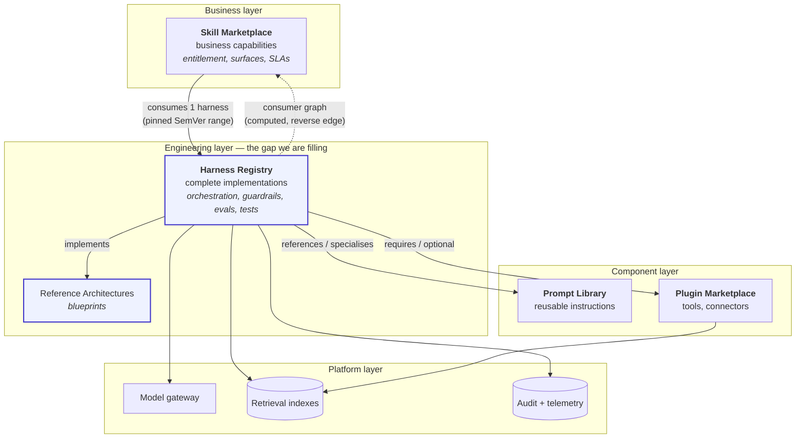

**Boundary rules** (enforced in review, and partly in CI):

1. A skill contains **no prompts and no orchestration**. If it does, it is a
   harness wearing a skill's clothes.
2. A harness contains **no entitlement logic, no UI and no business branding**.
3. A prompt in the Prompt Library is a *starting point*; a prompt inside a
   harness is *versioned, tested and evaluated in context*. The library links to
   harnesses that use it; the harness links back. Neither vendors the other.
4. A plugin is invoked by harnesses; it never invokes one. Plugins have no
   knowledge of harnesses — that acyclicity keeps the dependency graph sane.

### 1.4 System architecture

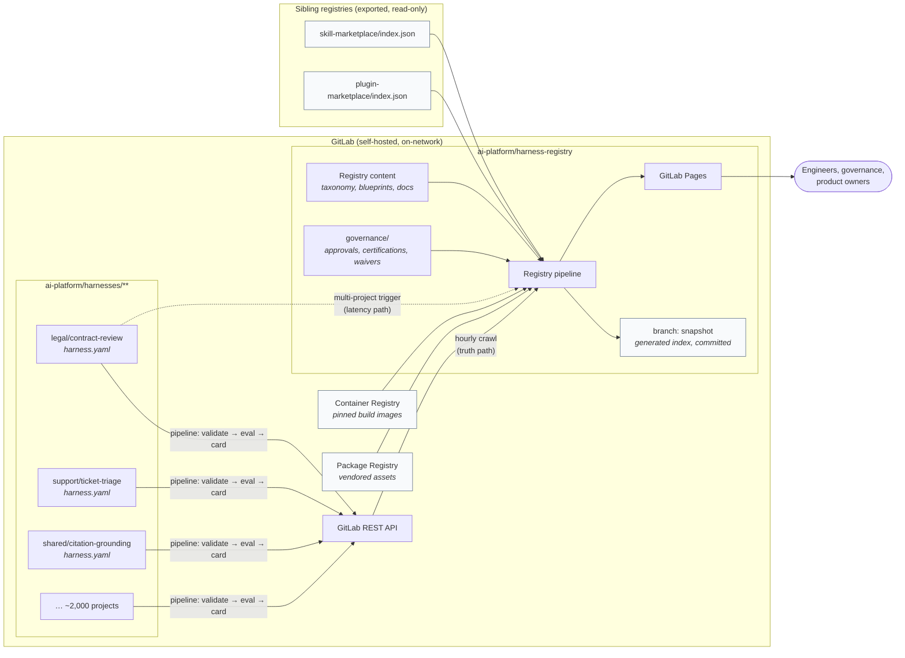

### 1.5 Data flow: from commit to published card

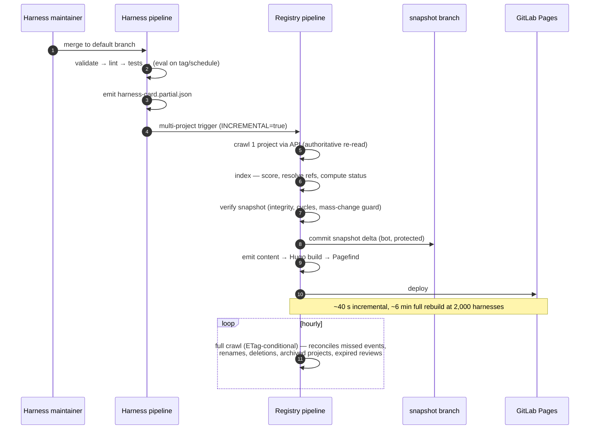

Note step 4→5: the pipeline **re-reads the project through the API** even though
the harness just handed it a card. The self-published card is a latency
optimisation and a self-description; it is never trusted as the source of truth.
This is what makes D3 enforceable.

---

## 2. Information architecture

Navigation is designed around **five real user journeys**, not around a sitemap.
Every top-level item must serve a journey; anything that does not is a link in a
footer, not a nav entry.

| Journey | Who | Entry point |
|---|---|---|
| "Has someone already built this?" | AI engineer starting work | Search, Browse |
| "Can I trust this enough to ship it?" | Engineer evaluating adoption | Harness page → Evaluation, Quality |
| "What is our AI estate, and what is risky?" | Governance, risk, security | Administration, Evaluation Results, Categories |
| "What does my team own, and what is overdue?" | Team lead, harness owner | Teams, Owners |
| "How should I build this kind of thing?" | Engineer designing | Reference Architectures, Documentation |

```mermaid
flowchart TD
    HOME["Home"] --> BROWSE["Browse"]
    HOME --> SEARCH["Search"]
    HOME --> RA["Reference Architectures"]
    HOME --> DOCS["Documentation"]

    BROWSE --> CAT["Categories"]
    BROWSE --> TEAMS["Teams"]
    BROWSE --> OWN["Owners"]
    BROWSE --> RECENT["Recently Updated"]
    BROWSE --> POP["Most Used"]
    BROWSE --> NEW["New & Rising"]

    CAT --> BD["Business domain"]
    CAT --> TD["Technical domain"]
    CAT --> LC["Lifecycle"]
    CAT --> ARCH["Architecture pattern"]

    SEARCH --> HP["Harness page"]
    CAT --> HP
    TEAMS --> HP
    RA --> HP

    HOME --> EVAL["Evaluation Results"]
    EVAL --> LEAD["Leaderboards"]
    EVAL --> TREND["Trends & regressions"]
    EVAL --> COMPARE["Compare harnesses"]

    HOME --> ADMIN["Administration"]
    ADMIN --> HEALTH["Registry health"]
    ADMIN --> GOVQ["Governance queue"]
    ADMIN --> ORPH["Orphans & overdue reviews"]
    ADMIN --> POL["Policies & taxonomy"]

    classDef leaf fill:#f8fafc,stroke:#94a3b8;
    class BD,TD,LC,ARCH,LEAD,TREND,COMPARE,HEALTH,GOVQ,ORPH,POL leaf;
```

### 2.1 Why each section exists

**Home** — answers "what is this and what do I do next" in one screen: a search
box with focus on load, four task-shaped entry points ("find a harness", "build a
new one", "adopt one in a skill", "review the estate"), a small set of
statistics (harness count, certified count, evals in the last 7 days), and recent
activity. *Not* a marketing page. Rejected: a curated "featured harness" carousel
— it becomes stale, and curation is a recurring cost nobody owns.

**Browse** — the entry point for people who cannot name what they want. At
thousands of harnesses, unstructured browsing is useless, so Browse is a set of
*pre-filtered lenses* onto the same faceted list, all of which are shareable URLs
(`/browse/?bd=legal&lc=certified`).

**Search** — the primary interface for anyone who *can* name what they want.
Design in §7. Every other navigation route is a permalink into a search state,
which means we maintain one query engine, not several.

**Categories** — the taxonomy made navigable, on two independent axes (business
and technical) plus lifecycle and architecture pattern. Category pages are also
where a domain steward writes editorial guidance ("in Legal, start with
`contract-review`; do not build a new clause segmenter") — the one place we allow
human curation, because it is high-value, low-volume and clearly owned.

**Teams** — a team page shows everything a team owns, its aggregate quality
distribution, overdue reviews, open governance items and inbound dependencies.
Two audiences: engineers looking for the right people, and team leads looking at
their own house. Team pages create healthy visibility; they are also the artefact
that makes ownership feel real.

**Owners** — distinct from Teams: an *owner* is the accountable group in the
manifest and may span teams. Critical for the "this harness looks abandoned" and
"who do I ask" cases, and for the reorganisation problem — when a team dissolves,
the Owners view shows exactly what needs rehoming. Includes an **unowned
harnesses** list, which should always be empty and never is.

**Recently Updated** — freshness signal and a de-facto activity feed. In an
enterprise this is also how governance notices work happening without asking.
Filterable by change type: new harness, new release, eval regression, lifecycle
change, deprecation.

**Popular / Most Used** — adoption evidence. Deliberately *not* page views:
popularity is measured as **consumer count** (skills depending on it), inbound
harness dependencies, and forks. These are structural facts from the graph, not
analytics, which means they work offline and cannot be gamed by refreshing.
Page-view analytics arrive in Phase 6 as a *secondary* signal only (§20).

**Reference Architectures** — the blueprint layer (§15). Answers "how should
this kind of thing be built" before anyone writes code, and gives the registry a
teaching function rather than just a listing function. Each blueprint links to
its conforming harnesses, which is the fastest path from "I need a RAG system"
to "here are five, one of them is certified".

**Evaluation Results** — cross-harness evaluation view: leaderboards within a
comparable class, regression alerts, model-upgrade impact ("what changed when the
gateway moved to build b41?"), and coverage gaps. This is the section that makes
the registry an engineering platform rather than a documentation site.

**Documentation** — how to build, publish, version, evaluate and govern a
harness; the contribution guide; the schema reference; the ADRs behind the
registry itself. Includes copy-paste starter templates.

**Administration** — registry operations: indexing health and last crawl,
validation failures, orphaned/unowned harnesses, overdue reviews, expiring
waivers, taxonomy proposals, and the governance queue. Visible to everyone
(transparency is a feature), actionable by platform and governance. A registry
without an admin view degrades silently, and silent degradation is how catalogues
die.

### 2.2 URL design

URLs are a public contract; they appear in MRs, wikis, tickets and chat for
years. They must survive re-indexing, renames and re-organisation.

```
/                                     Home
/harnesses/<id>/                      Canonical harness page (id is immutable)
/harnesses/<id>/versions/<semver>/    Archived card for a released version
/harnesses/<id>/evaluations/          Full evaluation history
/browse/                              Faceted browse (state in query string)
/categories/<axis>/<term>/            e.g. /categories/business/legal/
/teams/<slug>/                        Team page
/owners/<group-path>/                 Owner page
/reference-architectures/<id>/        Blueprint
/evaluations/                         Cross-harness evaluation views
/docs/<path>/                         Documentation
/admin/                               Administration
/graph/                               Relationship explorer
```

Rules: the harness **id is immutable and never reused** (D2 makes the project
path mutable, so the id cannot be derived from it); renames emit a permanent
redirect stub page; retired harnesses keep their page forever with a retirement
banner and pointers to the replacement. Nothing 404s — a dead link in a two-year-old
ticket is a small failure of the platform, not of the person who wrote it.

---

## 3. Harness metadata model

The schema lives at [`schema/harness.schema.json`](../schema/harness.schema.json)
(JSON Schema draft 2020-12) and is the single enforcement point: the same file
validates in the harness pipeline, in the registry indexer, and in the editor via
`yaml.schemas`.

### 3.1 The declared/observed split (D3)

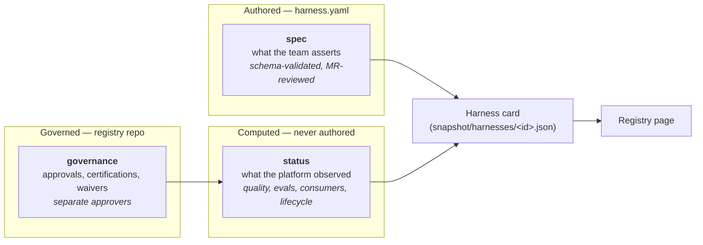

If a field can be *observed*, it must be observed. Authors control intent;
the platform controls facts. This one rule is what stops the registry becoming a
wall of self-awarded gold stars.

### 3.2 Declared fields (`harness.yaml`)

| Field | Purpose | Type | Validation | Example |
|---|---|---|---|---|
| `apiVersion` | Schema version; allows v1/v2 coexistence during migration | string | enum, single current value | `harness.registry.acme.internal/v1` |
| `kind` | Document discriminator | string | `Harness` | `Harness` |
| `metadata.id` | Immutable global identity; the URL and the dependency key | string | `^[a-z0-9]([a-z0-9-]{1,48}[a-z0-9])$`, unique across registry, never reused | `contract-review` |
| `metadata.name` | Human title | string | 3–64 chars | `Contract Review Harness` |
| `metadata.summary` | One-sentence value proposition on cards and search hits | string | 20–200 chars; lint rejects "This harness…" boilerplate | `Clause-level risk review of commercial contracts…` |
| `metadata.description` | Long-form abstract | string | ≤ 2000 chars; prefer README | *(see example)* |
| `metadata.owner` | Accountable **group** (never an individual — people leave) | string | `^group:…`; group must exist in GitLab and have ≥ 2 members | `group:legal-ai-platform` |
| `metadata.maintainers` | Individuals who merge | array[string] | 1–10; `@handle`; must match CODEOWNERS | `["@a.okafor"]` |
| `metadata.team` | Canonical team slug for team pages | string | must exist in registry `teams.yaml` | `legal-ai-platform` |
| `metadata.tags` | Folksonomy; feeds tag clouds and search boost | array[string] | ≤ 12, kebab-case, deduplicated | `[contracts, citations]` |
| `spec.version` | SemVer of the **contract** (§12) | string | SemVer; on a tag, must equal the tag | `2.3.1` |
| `spec.lifecycle` | Declared maturity (§9) | enum | 7 values; downgraded by the indexer if gates unmet; `certified` requires a governance record | `certified` |
| `spec.domains.business` | Whose problem it solves; primary navigation axis | array[enum] | 1–3 terms from `taxonomy.yaml` | `[legal, procurement]` |
| `spec.domains.technical` | How it is built | array[enum] | 1–4 terms from `taxonomy.yaml` | `[workflow, hybrid-search]` |
| `spec.architecture.pattern` | Reference architecture implemented | enum | exactly one, from the curated blueprint list | `document-review` |
| `spec.architecture.deviations` | Honest record of departures from the blueprint | array[string] | ≤ 300 chars each | *(see example)* |
| `spec.models.supported` | Models the harness is *proven* on | array[enum] | ≥ 1; ids from `models.yaml`; each must appear in an eval report or CI warns | `[claude-opus-5, claude-sonnet-5]` |
| `spec.models.default` | Model used when the consumer says nothing | enum | must be in `supported` | `claude-sonnet-5` |
| `spec.models.unsupported` | Negative results, with reasons — prevents repeated failed experiments | array[object] | `model` + `reason` required | `{model: claude-haiku-4-5, reason: "F1 0.71 < 0.85 gate"}` |
| `spec.runtimes` | Execution environments proven to work | array[enum] | ≥ 1, from `runtimes.yaml` | `[agent-sdk-python, cli]` |
| `spec.plugins.required` | Hard dependencies; absence means it cannot run | array[pluginRef] | id must exist in Plugin Marketplace index; range must resolve | `{id: pii-redactor, range: "^2.0.0"}` |
| `spec.plugins.optional` | Enhancements | array[pluginRef] | as above | `{id: matter-management, range: "^4.1.0"}` |
| `spec.retrieval` | Retrieval design, so RAG choices are comparable across the estate | object | `strategy` enum; `index` is a logical name, **never** a connection string | `{strategy: hybrid, top_k: 8}` |
| `spec.dependencies` | Harness→harness edges | array[object] | id must exist; range must resolve; **cycles fail the pipeline** | `{harness: citation-grounding, range: "^2.2.0"}` |
| `spec.interfaces.inputs` / `.outputs` | **The SemVer-governed contract** | array[ioField] | ≥ 1 each; snake_case names; typed | `{name: contract_file, type: file, format: pdf}` |
| `spec.interfaces.config_schema` | Path to the runtime config JSON Schema | string | file must exist and be a valid closed schema | `config/schema.json` |
| `spec.guardrails` | Declared controls and their enforcement strength | array[object] | each must be wired to a workflow step (CI-checked) and have a test | `{id: citation-required, type: grounding-check, enforcement: blocking}` |
| `spec.policies` | Corporate policies assessed against | array[string] | `^POL-\d{4}$`, must exist in `policies.yaml` | `[POL-0014]` |
| `spec.security.classification` | Highest data sensitivity handled | enum | public / internal / confidential / restricted | `confidential` |
| `spec.security.risk_level` | Inherent risk before controls | enum | low/medium/high/critical; governance may **raise**, never lower | `high` |
| `spec.security.data_types` | What kinds of data flow through | array[enum] | ≥ 1; drives mandatory guardrail checks | `[legal-privileged, customer-pii]` |
| `spec.security.human_review` | Whether a human must approve output | enum | not-required / recommended / required / required-dual | `required` |
| `spec.security.egress` | Logical outbound destinations | array[string] | internal hostnames or `none`; external hosts fail the policy check | `[none]` |
| `spec.operations.estimated_cost` | Budget planning | object | value ≥ 0, currency enum, **`basis` mandatory** so the figure is judgeable | `{unit: per-document, value: 0.42, currency: GBP, basis: "…250 runs"}` |
| `spec.operations.estimated_latency` | UX planning | object | p50/p95 in ms + `measured_on` date; stale > 180 days is flagged | `{p50_ms: 74000, p95_ms: 168000}` |
| `spec.operations.concurrency` | Safe parallelism | integer | ≥ 1 | `8` |
| `spec.operations.support` | Support commitment | enum | none / best-effort / business-hours / 24x7 | `business-hours` |
| `spec.limitations` | **Mandatory.** What it cannot do | array[string] | ≥ 1 (≥ 3 for team-ready and above), 10–300 chars | `"English-language contracts only"` |
| `spec.roadmap` | Planned direction, so consumers can wait rather than fork | array[object] | `item` required; `target` is a quarter or SemVer; `issue` links to GitLab | `{item: "Redline DOCX", target: "3.0.0", issue: "#388"}` |
| `spec.deprecation` | Retirement plan | object | required iff lifecycle is deprecated/retired; forbidden otherwise; `removal_after` ≥ `since` + 90 days | `{since: 2026-08-18, replaced_by: contract-review, removal_after: 2027-02-18}` |
| `spec.licensing.license` | Legal basis for reuse | string | SPDX id or `ACME-Internal-1.0` | `ACME-Internal-1.0` |
| `spec.licensing.third_party_review` | Whether Legal cleared bundled third-party content | boolean | must be `true` for org-ready+ if `attribution` is non-empty | `true` |
| `spec.links.repository` | Canonical source | string(uri) | must match `^https://gitlab.acme.internal/` and resolve | *(project URL)* |
| `spec.links.documentation` | Docs entry point | string | repo-relative path or internal URL; link-checked | `docs/index.md` |
| `spec.links.support_channel` | Where to ask | string | channel must exist | `#ai-legal-platform` |
| `spec.example_skills` | Advisory pointers to consuming skills | array[string] | `skill://<id>`; **advisory only** — the real list is computed | `[skill://contract-triage]` |

### 3.3 Computed fields (`status`, written only by the indexer)

| Field | Purpose | Type | Derivation | Example |
|---|---|---|---|---|
| `status.source.project` / `.commit` / `.visibility` | Provenance and reproducibility | string | GitLab API | `ai-platform/harnesses/legal/contract-review` |
| `status.source.manifest_digest` | Change detection and audit | string | `sha256` of `harness.yaml` | `sha256:9f2c…` |
| `status.released_version` | What consumers actually get | string | newest GitLab Release tag | `2.3.1` |
| `status.versions` | Version picker and archive pages | array[string] | release tags | `[2.3.1, 2.3.0, …]` |
| `status.last_updated` | Freshness | datetime | `last_activity_at` | `2026-07-19T03:12:04Z` |
| `status.pipeline_status` | Is it even building? | enum | latest default-branch pipeline | `success` |
| `status.quality.score` / `.band` / `.breakdown` | **Quality score** (§9) | integer 0–100 + breakdown | `quality-rubric.yaml` applied to observed signals | `92`, band `A` |
| `status.lifecycle.effective` | Maturity you can trust | enum | declared, downgraded if gates unmet | `certified` |
| `status.lifecycle.downgraded` / `.reasons` | Explains a downgrade to the owner | bool + array | gate evaluation | `false`, `[]` |
| `status.approval.state` | **Approval status** | enum | `governance/approvals/<id>.yaml` | `approved` |
| `status.approval.last_reviewed` / `.review_due` / `.overdue` | **Last reviewed** and review debt | date, date, bool | governance record + interval for the tier | `2026-07-10`, `2026-10-08`, `false` |
| `status.evaluation` | **Evaluation score** and latest suite results | object | newest `EvaluationReport` | `pass_rate 0.962` |
| `status.evaluation_trend` | Sparkline / trend chart series | array[object] | last 30 reports | *(series)* |
| `status.consumers` / `.consumer_count` | **Consumers** — who actually depends on this | array + int | reverse index over Skill Marketplace manifests | 3 skills |
| `status.plugin_resolution` | Whether declared plugin ranges actually resolve, and their trust tier | array[object] | Plugin Marketplace index | `{id: pii-redactor, resolved: 2.1.0, trust_tier: core}` |
| `status.warnings` | Everything the indexer disliked | array[string] | validation + gate evaluation | `["latency measured_on is 210 days old"]` |
| `status.indexed_at` | Staleness of the card itself | datetime | index run time | `2026-07-25T06:00:11Z` |

### 3.4 Field design rules

1. **Mandatory honesty fields.** `limitations` and `models.unsupported` are the
   two fields most likely to be omitted and most valuable when present. The first
   is required; the second is nudged by the rubric. A registry of only good news
   is not trusted twice.
2. **Every estimate carries its basis.** `estimated_cost.basis` and
   `estimated_latency.measured_on` are required. An unattributed number is worse
   than no number, because it gets pasted into a business case.
3. **Logical names, never endpoints.** `retrieval.index: legal-playbook-v7`, not
   a URL. Manifests are indexed into an internal-visible site; they must not
   become a network map.
4. **Enums over free text** wherever a comparison will be made. Free text kills
   faceting, and faceting is most of the product.
5. **Closed schemas.** `additionalProperties: false` everywhere. Extension goes
   through a schema MR, which is a feature: it forces a conversation about
   whether the field belongs in the shared model or in the harness's own docs.

---

## 4. Repository structure

### 4.1 One harness, one project — not a monorepo

This is the first structural decision and it is load-bearing.

| Concern | One project per harness ✅ | Monorepo of harnesses ❌ |
|---|---|---|
| Access control | Native GitLab project visibility; a `restricted` harness is simply a private project | Path-based ACLs GitLab does not really have |
| CODEOWNERS | Team-scoped and simple | One enormous file, constant merge conflicts |
| CI cost | Pipeline runs only for the harness that changed | Path rules, or 2,000 evals per commit |
| Releases & tags | `v2.3.1` means one thing | `contract-review/v2.3.1` tag soup |
| Issues & milestones | Per-harness backlog | Label discipline nobody sustains |
| Blast radius | A broken harness breaks itself | A bad merge blocks everyone |
| Discovery | Crawl finds it automatically | Also fine |
| Cross-cutting refactor | Harder — needs a scripted MR train | Easier |

The last row is the real trade-off, and we accept it: cross-cutting changes are
rare, and we mitigate them with `harnessctl bulk-mr` (a scripted fan-out that
opens the same MR across N projects and tracks them on one board). Everything
above that row happens weekly.

**Group hierarchy** mirrors the business taxonomy, because GitLab permissions are
group-shaped:

```
ai-platform/
  harness-registry/                 # the registry itself (site, schema, governance)
  harnesses/
    legal/          contract-review, clause-extraction, …
    support/        ticket-triage, agent-assist, …
    finance/        reconciliation-assistant, …
    engineering/    code-review-assistant, sql-agent, …
    shared/         document-segmentation, citation-grounding, …   # composable building blocks
    sandbox/        <experimental harnesses; excluded from default browse>
  templates/
    harness-template/               # `New project from template`
```

`shared/` is where genuinely reusable sub-harnesses live and is the antidote to
copy-paste at the *implementation* level. `sandbox/` is indexed but hidden behind
a filter — experimental work must be visible to governance without polluting
discovery.

### 4.2 Standard layout

```
contract-review/
├── harness.yaml                    # ① the manifest — the registry contract
├── harness.lock                    # ② resolved dependency versions (generated)
├── README.md                       # ③ required H2 sections, rendered on the card
├── CHANGELOG.md                    # ④ Keep-a-Changelog; gated on release
├── CODEOWNERS                      # ⑤ must match metadata.maintainers
├── .gitlab-ci.yml                  # ⑥ includes the shared template; ~5 lines
│
├── prompts/                        # ⑦ versioned prompts with front-matter contracts
│   ├── system.md
│   ├── clause-classification.md
│   ├── finding-generation.md
│   └── _partials/
├── workflows/                      # ⑧ declarative orchestration + step code
│   ├── review.yaml
│   └── steps/
├── config/                         # ⑨ closed JSON Schema + defaults; no secrets
│   ├── schema.json
│   └── default.yaml
├── guardrails/                     # ⑩ policy-as-data for filters and checks
│   └── no-advice.yaml
├── schemas/                        # ⑪ model response schemas (closed)
│   ├── classification.json
│   └── finding.json
│
├── evaluations/                    # ⑫ the evidence layer
│   ├── thresholds.yaml             #    gates (co-owned with governance)
│   ├── suites/*.yaml               #    suite definitions
│   ├── metrics/*.py                #    metric implementations
│   ├── rubrics/*.md                #    versioned judge rubrics
│   ├── results/*.json              #    machine-readable reports (CI-written)
│   └── human-review/*.md           #    signed-off manual reviews
├── datasets/                       # ⑬ data + manifests (Git LFS)
│   └── golden-contracts/{manifest.yaml,cases/,documents/,SHA256SUMS}
├── conversations/                  # ⑭ regenerated sample runs
├── tests/                          # ⑮ fast, deterministic, no model calls
├── architecture/                   # ⑯ Mermaid diagrams + ADRs
│   ├── overview.mmd
│   ├── sequence.mmd
│   └── decisions/ADR-*.md
├── docs/                           # ⑰ quickstart (executable), config, migrations
├── examples/                       # ⑱ sample inputs + integration guidance
└── assets/                         # ⑲ screenshots; strict size/provenance rules
```

### 4.3 Why this shape

- **① `harness.yaml` at the root** is the registration mechanism (D2). Root-level
  because a crawl that has to search for it is a crawl that is slow and wrong.
- **② `harness.lock`** makes "it worked in March" reproducible in September.
  Ranges express intent; the lockfile expresses reality.
- **③ README with required H2 sections** — the registry extracts them into the
  card, so structure is not cosmetic: it is an API. The rubric scores it.
- **⑦ prompts as files with front matter**, not strings in code. They get diffs,
  reviews, versions, token budgets and tests. The single highest-leverage
  structural choice in the whole layout, and the one teams push back on most.
- **⑧ workflows as declarative YAML** with code only in `steps/`. Control flow
  should be readable by a reviewer who does not read Python, and diffable when
  behaviour changes. It also lets the registry render the orchestration graph.
- **⑩ guardrails as data** so security can review a YAML file instead of reading
  the implementation, and so the same guardrail can be shared between harnesses.
- **⑫/⑬ evaluations and datasets in-repo.** Evidence travels with the code it
  evidences. A dataset in someone's home directory is not evidence.
- **⑯ ADRs in-repo.** The most valuable content in a mature harness is *why not*:
  why not fixed chunking, why not long context. Institutionally, this is the
  knowledge that otherwise walks out of the door.
- **⑰ executable quickstart.** CI runs it. Documentation that cannot rot is the
  only documentation that does not rot.

Required for validation: ①③⑥ and `spec.limitations`. Required for `team-ready`:
add ④⑦⑫⑮. Required for `org-ready`: add ⑯ and a dataset manifest. The layout is
a ladder, not a wall — a five-file experimental harness is legitimate and should
stay cheap to publish.

### 4.4 The template project

`ai-platform/templates/harness-template` is a GitLab project template. `harnessctl
new` (or *New project → From template*) scaffolds the full tree with TODO markers,
a working example prompt and a green pipeline in under a minute. Adoption of a
standard is set by the cost of the first ten minutes.

---

## 5. Registry indexing

### 5.1 Requirements

1. A new harness appears without anyone registering it (D2).
2. A change appears within ~1 minute, not the next day.
3. A deleted, archived or renamed project disappears (or redirects) reliably.
4. The truth cannot drift, even if events are lost.
5. It must scale to ~5,000 projects on a self-hosted GitLab without hammering it.
6. It must fail *loudly and safely* — never publish an empty or half-crawled index.

### 5.2 The design: crawl for truth, push for latency (D4)

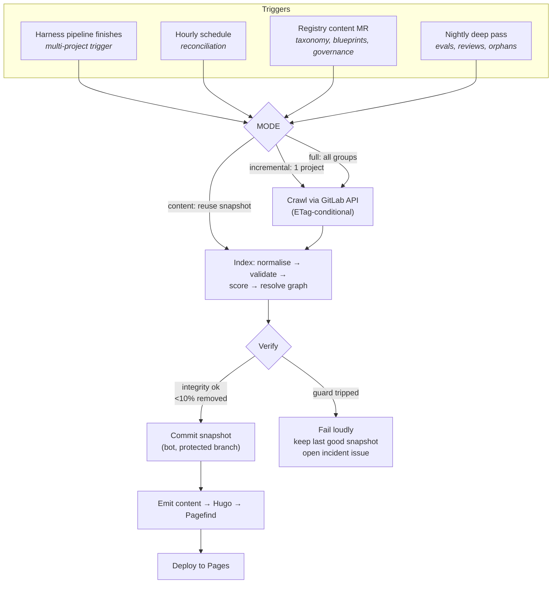

**Why not each alternative on its own:**

| Option | Verdict |
|---|---|
| Manifest file listing all harnesses | ❌ Rejected. Central list = merge conflicts, staleness, and a gatekeeper. Violates D2. |
| Webhooks only | ❌ Rejected as sole mechanism. Webhook delivery is best-effort; a lost event means a permanently wrong card with no self-healing. |
| Crawl only | ⚠️ Correct but slow. A contributor who waits an hour to see their harness stops contributing. |
| GitLab search API for `harness.yaml` | ⚠️ Used as a *cross-check* in the nightly pass, not as the primary crawl: advanced search indexing lags and is not guaranteed enabled. |
| **Crawl + push trigger** | ✅ **Chosen.** Push gives 40-second feedback; the hourly crawl is authoritative and self-healing. |

**Cost control.** Every API read is `If-None-Match` conditional against a cached
ETag, so a full crawl of 2,000 projects with 20 changed is ~2,000 cheap 304s and
~20 real reads. Measured shape: ~6 API calls per project per full crawl
(project, manifest, commit, pipeline, jobs, releases). At 2,000 projects with 16
threads: **~4 minutes wall clock**, comfortably inside an hourly schedule. At
5,000 projects we move the full crawl to every 3 hours and lean on the push path
— or shard the crawl by group across parallel jobs, which the design already
supports (`--groups` takes a subset).

**Safety rails** (all implemented in `registryctl`):

- *Error-rate guard*: a crawl erroring on > 2% of projects refuses to publish.
- *Mass-change guard*: a snapshot removing > 10% of harnesses fails the pipeline
  and opens an incident issue. Token expiry and group renames are the two most
  likely causes of an accidentally empty registry; both are caught here.
- *Last-good-snapshot*: Pages keeps serving the previous deploy on any failure.
  Staleness is a nuisance; an empty registry is an outage.
- *Per-project isolation*: one malformed manifest degrades one card (rendered
  with an error banner and an auto-filed issue), never the build.

### 5.3 What the indexer produces

The snapshot is committed to a protected `snapshot` branch by a bot:

```
snapshot/
  registry.lock.yaml         # id -> project, commit, release, manifest digest
  harnesses/<id>.json        # the card: spec + status
  graph/edges.json           # typed nodes and edges
  evaluations/<id>/*.json    # collected reports + derived trend series
  catalog.json               # compact faceting payload (~1.2 KB/harness)
  reports/index-report.json  # warnings, downgrades, orphans, unresolved refs
```

Committing the snapshot is what turns "a build artefact" into an **auditable
history**: `git log -p snapshot -- harnesses/contract-review.json` shows exactly
when a lifecycle changed, a score moved or a consumer appeared, with the commit
that caused it. It also makes rollback trivial and diffs reviewable in MRs. The
cost is a repository that grows; at 5,000 harnesses × ~8 KB × a few changes a day
this is a few hundred MB a year, and we shallow-prune the branch annually into an
archive project.

### 5.4 Deletion, rename and archive semantics

| Event | Detection | Behaviour |
|---|---|---|
| Project archived | `archived: true` in crawl | Card marked `archived`, hidden from default browse, page retained |
| Project deleted | Absent from full crawl (never from incremental) | Card marked `unreachable` for 7 days, then moved to a tombstone page; ids are never reused |
| Project renamed/moved | Same `metadata.id`, new path | Card follows the id; old path redirect stub emitted |
| `harness.yaml` removed | Absent on crawl | Treated as deliberate deregistration; tombstone + issue to the owner |
| Duplicate `metadata.id` | Two projects, same id | **Hard failure.** Both cards flagged, an issue opened on both, oldest project wins until resolved |

Note the asymmetry: **deletions are only ever concluded from a full crawl**, never
from an incremental run. An incremental pass sees one project and must never infer
absence.

---

## 6. Static site generation

### 6.1 Requirements

Static output only · Markdown-first authoring · thousands of data-driven pages ·
offline (no CDN, no web fonts, no telemetry) · fast full builds (target < 10 min
at 5,000 harnesses; < 90 s incremental) · client-side search · dark mode ·
WCAG 2.1 AA · responsive · maintainable by a small platform team.

### 6.2 Option comparison

| | **Hugo** | MkDocs Material | Docusaurus | Astro | Eleventy |
|---|---|---|---|---|---|
| Toolchain | Single Go binary (~50 MB) | Python + pip deps | Node + ~1,200 npm packages | Node + npm | Node + npm |
| Offline vendoring | ⭐ Copy one binary | Good (internal PyPI) | Painful (large tree, transitive churn) | Painful | Moderate |
| Build, 5,000 data pages | ⭐ ~20–40 s | ~3–6 min | ~15–30 min | ~4–8 min | ~2–5 min |
| Data-driven page generation | ⭐ Native (`data/`, content adapters) | ⚠️ Needs plugins (`gen-files`, `macros`) | Good (plugin API) | ⭐ Excellent | Good |
| Markdown docs authoring | Good | ⭐ Best-in-class | Very good | Good | Good |
| Built-in search | Basic (needs Pagefind/Lunr) | ⭐ Bundled offline search | Bundled (Lunr) | BYO | BYO |
| Theming effort for our UX | Moderate (Go templates) | ⭐ Low, but constrained | Moderate (React) | Low | Moderate |
| Accessibility out of the box | Theme-dependent | ⭐ Strong | Good | Theme-dependent | Theme-dependent |
| Dark mode | Theme-dependent | ⭐ Built in | Built in | Theme-dependent | Theme-dependent |
| Supply-chain surface | ⭐ Tiny | Small | ⚠️ Large | ⚠️ Large | Moderate |
| Team skills needed | Go templates | Python/Jinja | React/TS | JS/TS | JS |
| Interactive components | Vanilla JS (we need little) | Limited | ⭐ React | ⭐ Islands | Vanilla |

### 6.3 Recommendation: **Hugo** (D5)

**Why.**

1. **Offline is the hardest constraint, and Hugo makes it trivial.** One static
   binary in the internal package registry, hash-pinned, baked into one container
   image. No `npm ci` behind a proxy, no transitive dependency that decides to
   fetch a font at build time. Docusaurus and Astro are better authoring
   experiences and worse air-gapped citizens; that trade is decisive here.
2. **We are generating, not authoring.** ~95% of pages come from `catalog.json`
   and `harnesses/*.json`. Hugo's data files and content adapters are built for
   exactly this, and it is the only candidate that renders thousands of them in
   seconds. Build time is not vanity: it sets how fast a contributor sees their
   harness, and slow builds get skipped, then disabled, then removed.
3. **Longevity.** A Go binary and Markdown will build in five years. A 2026
   `node_modules` tree behind an enterprise proxy in 2031 will not.
4. **Small supply-chain surface** matters disproportionately to a security-conscious
   organisation, and this site is internal-visible across the company.

**What we give up, and how we cover it.**

| Loss | Mitigation |
|---|---|
| MkDocs Material's excellent docs UX | Port its patterns (nav, admonitions, content tabs) into our theme; it is a fortnight, once |
| Bundled offline search | Pagefind gives better results and lazy-loaded indexes anyway (§7) |
| React components | We need three interactive widgets (facets, trend chart, graph). Vanilla JS + `<canvas>`/SVG, ~1,200 lines, no framework |
| Go template ergonomics | Genuinely worse than JSX. Contained by keeping logic in the indexer and templates dumb |

**Rejected specifically:** *MkDocs Material* — the strongest runner-up and the
right answer if this were a documentation site; it is not, it is a data
application with documentation in it, and its plugin-generated-page path is the
weakest part of an otherwise excellent tool. *Docusaurus* — best interactivity,
worst offline story, build times that become prohibitive at our page count.
*Astro* — technically ideal architecture (islands, content collections), rejected
solely on the npm supply chain in an air-gapped estate; revisit if we ever run an
internal npm mirror we trust. *Eleventy* — flexible and light, but we would build
the theme, the search and the data layer ourselves with less benefit than Hugo.

### 6.4 Stack

| Layer | Choice | Vendored as |
|---|---|---|
| Generator | Hugo extended 0.148.x | `hugo-extended` image, digest-pinned |
| Theme | In-house `harness-theme` | Repo (`themes/`), no upstream dependency |
| CSS | Hand-written, CSS custom properties, ~18 KB | Repo |
| Fonts | System font stack + Inter subset (WOFF2) | Repo (`static/fonts/`), licence recorded |
| Icons | Inline SVG sprite | Repo |
| Diagrams | Mermaid 10.9.x, client-side | `static/js/mermaid.min.js` (~1 MB, lazy-loaded, only on pages with diagrams) |
| Full-text search | Pagefind 1.1.x | `pagefind` image |
| Facet search | `catalog.json` + MiniSearch 6.x | `static/js/minisearch.min.js` (~12 KB) |
| Charts | Hand-rolled SVG from the trend series | Repo (~400 lines) |
| Graph | Precomputed layout → SVG; canvas for large graphs | Repo |

**Accessibility** is a pipeline gate, not an aspiration: `verify:site` samples 40
pages against WCAG 2.1 AA and fails on violations. Semantic landmarks, visible
focus rings, 4.5:1 contrast in both themes, full keyboard operation of facets,
`prefers-reduced-motion` respected, and — the one people forget — **every page
must be usable with JavaScript disabled**. Browse and search degrade to
server-rendered category listings; the harness pages are entirely static HTML.

**Dark mode** via `prefers-color-scheme` plus a persisted toggle, implemented with
CSS custom properties. Mermaid gets a matching theme injected at render time.

---

## 7. Search design

### 7.1 The two-tier problem

At 5,000 harnesses, one index cannot serve both needs. Full-text over all
documentation is tens of megabytes; metadata faceting needs to be instant and
combinatorial. So we build two, with different technologies, joined in the UI.

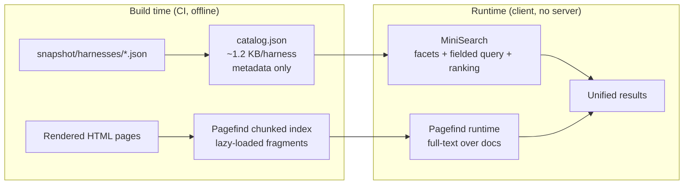

**Tier 1 — faceted metadata search.** `catalog.json` holds one compact record per
harness (short keys; see `build_catalog` in [`tools/registryctl/index.py`](../tools/registryctl/index.py)).
At 5,000 harnesses it is ~6 MB raw, ~1.1 MB gzipped, fetched once, cached, and
indexed in-browser by MiniSearch in ~150 ms. Every facet combination, sort and
range filter is then instant and offline. Deliberately excludes prose — that
exclusion is exactly what keeps it small.

**Tier 2 — full-text.** Pagefind indexes the rendered HTML (READMEs, docs, ADRs,
conversations) at build time and splits the index into chunks the browser fetches
only as the query narrows. Typical query costs 50–150 KB of transfer, not 40 MB.

If `catalog.json` exceeds 8 MB gzipped (~35,000 harnesses), we shard it by
business domain and load shards on demand. The interface does not change.

### 7.2 Supported query surface

| Facet | Source | Type | UI |
|---|---|---|---|
| Text (title, summary, tags) | `catalog.json` | fuzzy + prefix, field-boosted | Search box |
| Text (full documentation) | Pagefind | stemmed full-text | Search box, second result group |
| Owner / team | `metadata.owner`, `.team` | exact, multi-select | Checkbox facet |
| Tags | `metadata.tags` | exact, multi-select, AND/OR | Tag cloud + facet |
| Business domain | `spec.domains.business` | exact, multi-select | Facet (primary) |
| Technical domain | `spec.domains.technical` | exact, multi-select | Facet (primary) |
| Architecture pattern | `spec.architecture.pattern` | exact | Facet |
| Models | `spec.models.supported` | exact, multi-select | Facet |
| Runtimes | `spec.runtimes` | exact | Facet |
| Required plugins | resolved plugin list | exact | Facet + "used by" from plugin pages |
| Lifecycle | `status.lifecycle.effective` | exact | Facet, default excludes retired |
| Version | `status.released_version` | SemVer range | Advanced |
| Quality score | `status.quality.score` | range slider | Facet |
| Evaluation score | `status.evaluation.totals.pass_rate` | range slider | Facet |
| Security classification | `spec.security.classification` | exact | Facet |
| Risk level | `spec.security.risk_level` | exact | Facet |
| Approval state | `status.approval.state` | exact | Facet |
| Consumers | `status.consumer_count` | range | Sort + facet |
| Last updated | `status.last_updated` | date range | Facet ("active in last 90 days") |

**Query language** for power users, parsed client-side into the same filter set:

```
rag owner:group:legal-ai-platform lifecycle:certified quality:>85
plugin:pii-redactor model:claude-sonnet-5 updated:<90d
"clause extraction" -lifecycle:deprecated
```

Bare terms → text search; `field:value` → facet; `>`/`<` → range; quotes →
phrase; `-` → negation. The URL always reflects the full state, so any search is
a shareable link — which is how search results end up in MRs and tickets, which
is how the registry becomes habitual.

### 7.3 Ranking

Relevance alone is wrong here: a perfectly-matching abandoned experiment should
not outrank a slightly-less-matching certified harness. Score:

```
score = text_relevance                        # MiniSearch BM25-ish, field-boosted
      × lifecycle_multiplier                  # certified 1.5, org-ready 1.3, team-ready 1.1,
                                              # prototype 0.9, experimental 0.7, deprecated 0.3, retired 0.1
      × (0.7 + 0.3 × quality_score/100)
      × (1 + min(consumer_count, 10) × 0.03)  # adoption, capped so winners don't run away
      × freshness_decay                       # 1.0 ≤ 180d, → 0.8 at 365d, floor 0.6
```

Field boosts: `name` ×3, `tags` ×2, `summary` ×2, domains ×1.5, body ×1. All
weights live in `search-weights.yaml`, are shown on `/docs/search-ranking/`, and
are tuned against a labelled query set (30 queries with expected top-3) that runs
as a CI check — ranking changes get the same evidence discipline as harnesses.

### 7.4 Offline index generation

Everything is a build artefact; nothing calls a service at runtime.

1. `index` writes `catalog.json` from the snapshot (compact keys, sorted for
   diff stability, `separators=(',',':')`).
2. Hugo renders pages with `data-pagefind-body` on content regions and
   `data-pagefind-filter` attributes mirroring the primary facets.
3. Pagefind runs over `public/` and emits `_pagefind/` (chunked, lazy).
4. `catalog.json` is gzipped alongside for Pages' pre-compressed serving.
5. `verify:site` asserts: catalog parses, record count matches the snapshot, no
   record exceeds 2 KB, total gzip size is under budget, and 10 canned queries
   return their expected top hit.

No search server. No Elasticsearch. Nothing to run at 3am.

---

## 8. Taxonomy

### 8.1 Reasoning

The prompt's example list mixes three incompatible things: business domains
(Customer Support, Legal, Finance), technical patterns (RAG, Agents, Planning)
and engineering concerns (Evaluation, Testing, Security, Governance). Flattening
them into one list is the classic taxonomy failure — every harness ends up in
six categories, category pages become unbrowsable, and the facet is useless
because everything matches.

We therefore use **two mandatory orthogonal axes plus two curated dimensions**:

| Axis | Question | Cardinality | Volatility | Owner |
|---|---|---|---|---|
| **Business domain** | Whose problem does this solve? | 1–3 of ~14 | Low (org-shaped) | Domain stewards |
| **Technical domain** | How is it built? | 1–4 of ~26, sub-grouped | Medium | Platform architecture |
| **Architecture pattern** | Which blueprint? | Exactly 1 of 13 | Low | Platform architecture |
| **Lifecycle** | How mature? | Exactly 1 of 7 | n/a — computed | Governance |

Tags remain free-form and unvalidated: folksonomy is where new vocabulary is
discovered. A tag used by ≥ 3 harnesses across ≥ 2 teams for ≥ 1 quarter becomes
a candidate for promotion into the taxonomy — that is the evidence rule in
[`schema/taxonomy.yaml`](../schema/taxonomy.yaml), and it prevents both
ossification and sprawl.

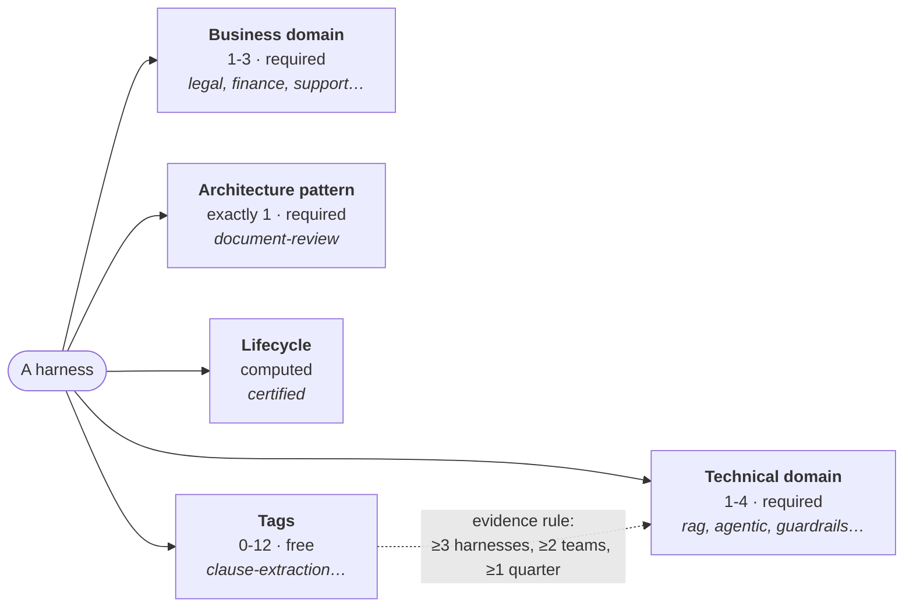

### 8.2 Business domains (~14)

`customer-support` · `legal` · `finance` · `risk-compliance` · `hr-people` ·
`sales-marketing` · `operations` · `engineering` · `it-service` · `security` ·
`data-analytics` · `knowledge` · `procurement` · `cross-functional`

These map to how the organisation is actually structured, because the questions
asked of this axis are organisational: "what does Legal have?", "who in Finance
is doing this?". Each has a **steward** — the person who writes the editorial
guidance on the category page and adjudicates placement disputes. Note the
deliberate inclusion of `engineering` and `security` as *business* domains: for
a developer-tools harness, engineers **are** the business.

`cross-functional` is the escape hatch and the main abuse risk. The indexer
warns when it exceeds 10% of the estate; if a genuine domain is hiding inside it,
that is the signal to add one.

### 8.3 Technical domains (~26, four sub-axes)

Sub-grouping keeps a 26-term facet usable:

| Sub-axis | Terms |
|---|---|
| **Orchestration** | `single-turn`, `conversational`, `workflow`, `agentic`, `multi-agent`, `planner-executor` |
| **Knowledge** | `rag`, `hybrid-search`, `graph-retrieval`, `sql-retrieval`, `long-context` |
| **Capability** | `tool-calling`, `code-generation`, `extraction`, `classification`, `summarisation`, `analysis`, `automation`, `multimodal` |
| **Concern** | `evaluation`, `testing`, `guardrails`, `governance`, `observability`, `infrastructure`, `developer-tools`, `productivity` |

The orchestration sub-axis is the one engineers actually search on, because it
predicts cost, latency, failure modes and reviewability more than anything else.
Note that `workflow` vs `agentic` is a genuine architectural fork, not a
spectrum: one has control flow in code, the other in model output.

### 8.4 What we deliberately did *not* do

- **No deep hierarchy.** Two levels maximum (sub-axis → term). Three-level
  taxonomies get 40% of items filed in the wrong place, and nobody re-files.
- **No "Other".** It absorbs everything and teaches nothing. `cross-functional`
  is the one bounded exception, and it is monitored.
- **No per-team categories.** Teams are a separate dimension (§2), not a
  taxonomy; conflating them means reorganisations invalidate the taxonomy.
- **No deletion, ever.** Terms are deprecated with `superseded_by` so old
  manifests keep validating and old URLs keep resolving.
- **No auto-classification at write time.** LLM-suggested terms in the MR are
  Phase 6 (§20), as a *suggestion to the author*. Silent auto-tagging destroys
  the trust that makes facets useful.

---

## 9. Harness quality model

### 9.1 Two independent measures

A common mistake is to collapse maturity and quality into one number. They answer
different questions:

- **Lifecycle** — *how far along is this, and what may I rely on it for?* A
  ladder with objective gates. Moves rarely; promotion is a deliberate act.
- **Quality score (0–100)** — *how well engineered is it right now?* Continuous,
  computed every index run, moves with evidence.

A `certified` harness can drop to 78 after a bad week (stale evals, red pipeline);
that visible drop is the point. Sustained failure triggers de-certification (§11).

### 9.2 Lifecycle ladder

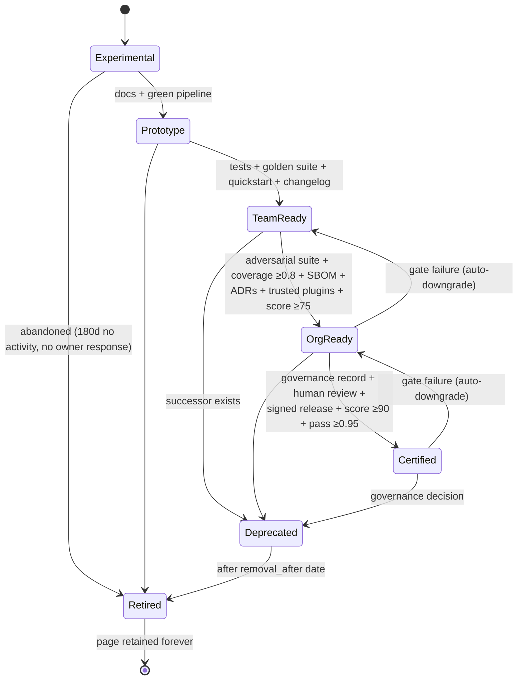

| Tier | Means | Objective gates | Review | Who promotes |
|---|---|---|---|---|
| **Experimental** | Someone is trying something. Do not depend on it. | Valid manifest; owner group with ≥2 members | 180d | Author (self) |
| **Prototype** | Works for its author on happy paths. | + README sections, green pipeline | 180d | Author (self) |
| **Team Ready** | The owning team runs it. Other teams may adopt with support. | + unit tests, golden suite ≥50 cases, executable quickstart, secret scan clean, changelog, **score ≥60** | 180d | Owner group |
| **Org Ready** | Any team may adopt without the owner's involvement. | + adversarial/guardrail suite, coverage ≥0.8, pinned deps, SBOM, architecture diagram, CODEOWNERS, trusted plugins, **score ≥75, pass rate ≥0.90** | 90d | Owner + platform review |
| **Certified** | Fit for regulated/high-risk use; platform stands behind it. | + signed release, reproducible eval, evals ≤30d old, human review, governance record, **score ≥90, pass rate ≥0.95** | 90d | Governance board MR |
| **Deprecated** | Still works, do not adopt. | `spec.deprecation` complete; successor named; ≥90d removal window; migration guide | — | Owner + governance |
| **Retired** | No longer supported. | Page retained with tombstone; id never reused | — | Governance |

Gates are machine-checked (`lifecycle_gates` in
[`schema/quality-rubric.yaml`](../schema/quality-rubric.yaml)). The indexer
**downgrades over-claims automatically and never upgrades** — promotion is a
human decision with a record; demotion is a fact.

### 9.3 Quality score

| Dimension | Weight | Rationale |
|---|---|---|
| Evaluation | 30 | Evidence that it works is the single most important thing |
| Engineering | 20 | Reproducibility, tests, pinning, green pipeline |
| Documentation | 15 | Undocumented reuse is not reuse |
| Security | 15 | Secrets, SBOM, signing, plugin trust |
| Metadata | 10 | Completeness and honesty of the declaration |
| Stewardship | 10 | Live owner, current review, responsive to issues |

Full signal list and points in the rubric file. Hard gates: invalid schema or a
secret-scan failure caps the score at **0**; a red pipeline caps it at **59**.

Three properties matter more than the exact weights:

1. **Every signal is observable.** No signal requires a human opinion, so nobody
   negotiates their score.
2. **The breakdown is always shown.** A score is displayed as `92 (A)` with a
   per-dimension bar and a list of failed signals, each linking to the fix. A
   number without a remedy is a scold, not a tool.
3. **The rubric is versioned and its changes are announced.** Score movement
   caused by a rubric change is labelled as such on trend charts — otherwise
   teams lose trust the first time everyone drops 8 points overnight.

### 9.4 Anti-gaming

The rubric is public, so it *will* be optimised for. That is fine — the signals
were chosen so that gaming them means doing the right thing. The two genuinely
gameable ones get specific defences:

- *Golden suite ≥50 cases* → could be padded with trivial cases. Defence:
  `coverage` measures exercised interfaces/guardrails/limitations, and human
  review at Certified samples real cases.
- *Pass rate* → could be inflated by weakening thresholds. Defence:
  `evaluations/thresholds.yaml` is CODEOWNED by governance, and threshold
  loosening shows on the harness page as a labelled event on the trend chart.

---

## 10. Evaluation framework

### 10.1 Principles

1. **Evaluation is a build artefact** (D8). Machine-readable, schema-validated,
   emitted by CI, collected by the indexer.
2. **Datasets are versioned, checksummed and described**, including their known
   biases. An eval without a dataset manifest is an anecdote.
3. **Gates block releases.** A threshold breach fails the pipeline; overriding it
   requires a waiver MR that expires and is displayed publicly.
4. **Trends beat snapshots.** The interesting question is never "what is the pass
   rate" but "what changed, and why" — model build, prompt version, dataset
   version, judge rubric.
5. **Model-graded metrics are declared as such**, with the judge model and rubric
   version recorded, because judge drift is a real and easily-hidden failure.
6. **Human review is a first-class suite kind**, not an afterthought.

### 10.2 Suite kinds

| Kind | Purpose | Cadence | Gated |
|---|---|---|---|
| `golden` | Core correctness on hand-labelled cases | Tag + nightly | ✅ |
| `regression` | Delta vs the last release, same dataset and model | Tag + nightly | ✅ |
| `adversarial` | Prompt injection, jailbreaks, unsafe output | Tag + nightly | ✅ |
| `security` | Data leakage, redaction bypass, egress attempts | Tag + weekly | ✅ |
| `guardrail` | Each declared guardrail actually fires | Every MR (cheap) | ✅ |
| `performance` | Latency distribution | Tag + nightly | ✅ (p95) |
| `cost` | Spend per unit of work | Tag + nightly | ✅ |
| `human-review` | Expert sample review | Per minor release | ✅ at Certified |

### 10.3 Metric catalogue

Names come from a shared `metrics.yaml` so dashboards can compare across
harnesses. Core metrics:

| Metric | Definition | Direction |
|---|---|---|
| `pass_rate` | Cases meeting all case-level assertions | ↑ |
| `coverage` | Share of declared interfaces, guardrails and limitations exercised by ≥1 case | ↑ |
| `hallucination_rate` | Outputs containing an unsupported factual claim (task-specific detector or judge) | ↓ |
| `grounding_rate` | Outputs whose every claim maps to retrieved/quoted evidence | ↑ |
| `citation_precision` | Citations that resolve and support the claim | ↑ |
| `refusal_appropriateness` | Correct refusals ÷ (correct + incorrect refusals + missed refusals) | ↑ |
| `injection_resistance` | Adversarial cases where injected instructions were not followed | ↑ |
| `p50/p95_latency_ms` | End-to-end wall clock | ↓ |
| `cost_per_case` | Total spend ÷ cases | ↓ |
| `human_agreement` | Agreement between automated verdict and expert review | ↑ |

Harness-specific metrics (e.g. `clause_f1`) are declared in the suite with their
implementation path — comparable within a class, not across the estate.

### 10.4 Regression handling

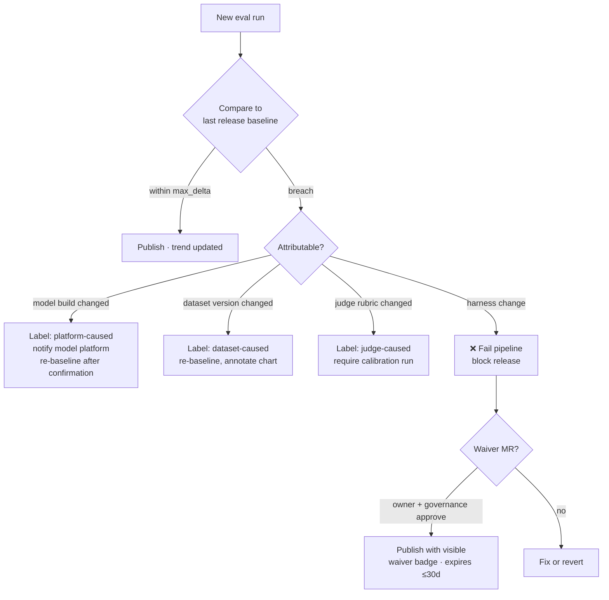

Attribution is the part most teams omit and the part that determines whether
anyone trusts the gate. Because every report records model build, dataset
checksum, plugin versions, seed and judge rubric, the indexer can attribute most
regressions automatically and say so on the chart.

### 10.5 Dashboards

**On the harness page:**

- Headline strip: pass rate, coverage, hallucination, p95 latency, cost — each
  with value, gate, pass/fail colour and 30-run sparkline.
- Trend chart: multi-series, with **annotation pins** for releases, model-build
  changes, dataset bumps and rubric changes. This turns "the score dropped" into
  "the score dropped when the gateway moved to b41".
- Suite table: expandable per suite, showing dataset id/version/size, case
  counts, per-metric values against thresholds.
- Failure explorer: the (redacted where necessary) failure list grouped by
  category — `segmentation`, `classification`, `playbook-gap` — which is how an
  adopter judges whether the failures matter *for them*.
- Human review panel: date, reviewers, sample size, agreement, verdict.
- Waiver banner if any gate is currently waived, with expiry and the MR link.

**Cross-harness (`/evaluations/`):**

- Leaderboards **within a comparable class** (same architecture pattern and
  similar task), never global — a global leaderboard comparing a SQL agent to a
  contract reviewer is noise that people nonetheless act on.
- Regression radar: every harness whose pass rate fell in the last 7 days.
- Coverage gaps: declared guardrails with no test; declared models never
  evaluated; limitations with no corresponding case.
- Model-upgrade impact: pass-rate delta by harness across a gateway build change
  — the view that turns a model upgrade from a leap of faith into a change plan.
- Freshness map: harnesses by days since last eval, by lifecycle tier.

All charts are inline SVG generated at build time from the trend series: no chart
library, no runtime fetch, printable, screen-reader accessible via an adjacent
data table, and legible in both themes.

---

## 11. Governance

### 11.1 Principles

- **Governance state lives in the registry, not the harness** (D6). Certification
  is an MR into `governance/` approved by people who are not on the producing
  team. Separation of duties is the entire point.
- **Publishing is free; claiming is expensive.** Anyone may publish an
  experimental harness with no approval whatsoever. Claims — org-ready,
  certified, "handles PII" — require evidence and review.
- **Governance runs on GitLab primitives.** MRs, approval rules, CODEOWNERS,
  protected branches, labels, issue boards, scheduled pipelines. No bespoke
  workflow engine.
- **Everything leaves a record.** Every state change is a commit with an author,
  a timestamp and a reviewed diff.

### 11.2 Roles

| Role | GitLab realisation | Rights |
|---|---|---|
| **Contributor** | Any engineer | Create harnesses, publish experimental/prototype, fork, open MRs and issues |
| **Maintainer** | `metadata.maintainers` + CODEOWNERS | Merge to default branch, cut releases, declare up to team-ready |
| **Owner group** | `metadata.owner` GitLab group | Everything a maintainer can do, plus request org-ready, deprecate, transfer ownership |
| **Domain steward** | Per business domain (`taxonomy.yaml`) | Curate the category page, adjudicate placement, sponsor org-ready |
| **Platform team** | `group:ai-platform` | Own registry, schema, rubric, CI templates; run the index; force-downgrade |
| **Governance board** | `group:ai-platform-governance` | Approve/revoke certification, approve waivers and threshold relaxations, mandate deprecation, set risk levels |
| **Security** | `group:security-engineering` | Approve plugin trust tiers, review restricted harnesses, force-archive on incident |
| **Legal** | `group:legal-ai-platform-review` | Approve licensing and dataset clearances |

### 11.3 Who can do what

| Action | Who | Mechanism | Evidence required |
|---|---|---|---|
| **Publish** (experimental) | Anyone | Create project from template, push `harness.yaml` | Valid manifest, owner group |
| **Publish** (prototype/team-ready) | Maintainer | Set `spec.lifecycle`, merge | Gates pass automatically |
| **Promote** to org-ready | Owner + domain steward | MR to `governance/approvals/<id>.yaml`, 2 approvals | Gates + platform review |
| **Certify** | Governance board | MR to `governance/certifications/<id>.yaml`, 2 board approvals + security + (if regulated) legal | Gates + human review + signed release |
| **Approve** a risk assessment | Governance board + security | Same MR, additional approval rule | Policy check output |
| **Deprecate** | Owner (notify) or governance (mandate) | Manifest `spec.deprecation` + governance record | Successor named, ≥90d window, migration guide |
| **Archive / Retire** | Governance (on schedule) or security (on incident) | Archive the project; tombstone card | `removal_after` passed, or incident reference |
| **Fork** | Anyone | GitLab fork; new `metadata.id` **required** | Fork rationale in README; parent linked in the graph |
| **Promote a fork** over the parent | Governance | Ownership transfer + deprecation of the parent | Evidence the fork is better maintained |
| **De-certify** | Governance, or automatically | Gate failure for 30 consecutive days → auto-downgrade + issue | Index report |
| **Waive** a gate | Owner + governance | MR with `eval-waiver` label, expiry ≤30 days | Justification, remediation plan |
| **Change taxonomy** | Governance | MR to `taxonomy.yaml`, 2 approvals | ≥3 harnesses would use the term |
| **Change the rubric** | Platform + governance | MR + announcement + annotated trend charts | Impact analysis over the estate |

### 11.4 GitLab workflows

**Certification** — the most formal path:

```mermaid
sequenceDiagram
    participant O as Harness owner
    participant R as Registry project
    participant B as Governance board
    participant S as Security
    participant P as Registry pipeline

    O->>R: MR adding governance/certifications/contract-review.yaml
    Note over R: CODEOWNERS demands 2 board approvals + security
    P->>P: Pipeline validates the claim against live gates:<br/>score ≥90, pass ≥0.95, evals ≤30d, signed tag,<br/>human review present, SBOM published
    P-->>R: ✅ evidence check passed (or ❌ with the exact failing gate)
    B->>R: Review evidence, approve
    S->>R: Review plugin trust, data types, egress, approve
    R->>R: Merge (protected branch)
    P->>P: Re-index → lifecycle becomes `certified`
    P-->>O: Card updated; certification expiry set to +90 days
```

The pipeline checks the *evidence* so humans review the *judgement*. Boards that
spend their time verifying checkboxes stop showing up.

**Review cadence** — a nightly job opens an issue on any harness whose review is
due in 14 days, escalates to the owner group at due date, and auto-downgrades one
tier at due + 30 days. Review debt is thereby self-clearing rather than
accumulating invisibly.

**Orphan handling** — a harness whose owner group has fewer than two members, or
whose maintainers are all deactivated, is flagged `unowned` on the Owners page,
an issue is opened against the domain steward, and after 60 days without an owner
it is auto-deprecated. Abandonment is the most common failure mode of any internal
catalogue; this is the countermeasure.

**Labels** (standardised across all harness projects via a group-level label set):
`lifecycle::*`, `governance::review-due`, `governance::certification`,
`eval::regression`, `eval::waiver`, `security::review`, `deprecation::planned`,
`registry::validation-failed`, `help-wanted`, `good-first-harness-issue`.

---

## 12. Versioning

### 12.1 What SemVer governs (D7)

The hardest question in versioning an AI system: prompts change constantly, and
every change alters behaviour. If every prompt edit were a major bump, versions
become meaningless; if none were, consumers get silently different behaviour.

We resolve it by defining the **contract** explicitly:

| In the contract (SemVer applies) | Not in the contract |
|---|---|
| `spec.interfaces.inputs` / `.outputs` | Prompt wording |
| `config/schema.json` | Retrieval `top_k` default (unless behaviour-material) |
| Declared guardrail ids and enforcement levels | Internal step decomposition |
| Required plugin ranges | Log formats, telemetry |
| Output value domains (e.g. the severity enum) | Latency and cost (tracked separately) |
| Supported models and runtimes | Documentation |

| Change | Bump | Also required |
|---|---|---|
| Remove/rename an output field; narrow an input type; add a required input; remove a supported model or runtime; raise a required plugin major; make an advisory guardrail blocking in a way that changes results | **MAJOR** | Migration guide, deprecation of the prior line, consumer notification |
| Add an optional input; add an output field; add a model/runtime; add an optional plugin; **behavioural change materially altering output distribution** | **MINOR** | Changelog entry describing the behavioural delta; re-baselined evaluation |
| Prompt clarification with no measurable metric movement; bug fix; docs; performance | **PATCH** | Changelog entry; evaluation shows no regression beyond `max_delta` |

The middle row is the one that matters and the one teams get wrong. The test is
empirical, not editorial: **if the evaluation moves beyond `max_delta`, it is at
least a MINOR**, whatever the diff looks like. `harnessctl check-versions`
enforces this by comparing the tagged run against the previous release.

`0.x` versions mean exactly what SemVer says — anything may change — and the
registry caps such harnesses at `prototype`.

### 12.2 Git strategy

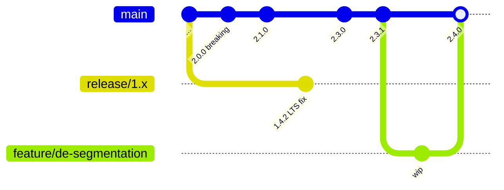

- **Trunk-based on `main`**, protected, short-lived feature branches, MR-only.
- **Tags are the release unit**: `v2.3.1`, signed, immutable, protected. Tagging
  runs the full evaluation matrix and creates a GitLab Release with notes, SBOM
  and evaluation artefacts attached.
- **Release branches only for LTS lines** (`release/1.x`). Creating one is a
  deliberate act with a declared end date; a branch per minor is overhead nobody
  maintains.
- **`spec.version` must equal the tag.** CI enforces it, which removes an entire
  class of "which version is this really" confusion.

### 12.3 LTS and support windows

| Line | Support | Content |
|---|---|---|
| Current major | Full | Features, fixes, security |
| Previous major (LTS) | 6 months from the successor's release, extendable to 12 by governance for certified harnesses | Security and correctness only |
| Older | None | Registry marks `retired` |

LTS status is declared in the governance record, not the manifest, so a team
cannot promise support the organisation has not resourced. The registry shows a
countdown banner from 90 days before LTS end, and the consumer graph tells us
exactly which skills to notify.

### 12.4 Compatibility and consumption

Consumers pin **ranges**, not exact versions: `^2.3.0` in the skill manifest,
resolved to a concrete version in the lockfile. The registry then provides what
no manifest can: **who is affected**. When `contract-review` publishes 3.0.0, the
consumer graph identifies the three consuming skills, and the pipeline opens an
issue in each of their projects with the migration guide linked.

A **compatibility matrix** is published per harness — version × model × runtime ×
plugin major — generated from evaluation runs, not from claims. "Supported" means
"there is a green evaluation run for this combination"; anything else is marked
untested, which is honest and unusual.

### 12.5 Breaking changes and migration

A MAJOR release is not accepted unless it ships:

1. A migration guide at `docs/migration-<from>-to-<to>.md` (link-checked, and
   required by CI when the major digit increments).
2. A migration tool or an explicit statement that migration is manual.
3. A deprecation of the previous line with a dated end of support.
4. An eval comparison old-vs-new over the same dataset, published on the page.
5. Notification issues raised in every consuming project (automated).

Point 4 is unusual and valuable: it forces the team to demonstrate the break was
worth it, in numbers, in public.

---

## 13. Relationships

### 13.1 The entity model

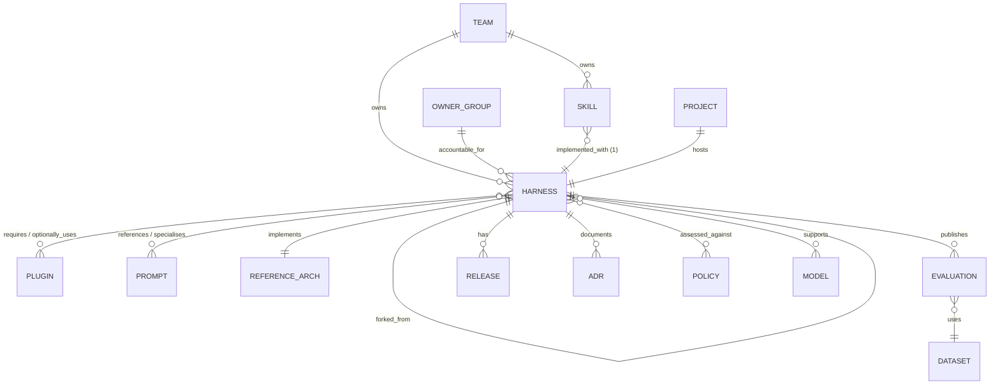

Cardinality choices worth defending:

- **Skill → Harness is 1:1 (a skill has exactly one harness).** A skill that
  needs two harnesses is either two skills, or the composition belongs in a
  harness that composes the two. This keeps the business layer thin and pushes
  engineering complexity into the layer built to hold it.
- **Harness → Harness is many:many**, with an acyclicity constraint enforced at
  index time. Composition is how `shared/` pays for itself.
- **Harness → Reference Architecture is exactly 1.** Multiple patterns per
  harness makes the pattern facet useless; deviations are declared instead.

### 13.2 Which edges are declared and which are computed

| Edge | Direction | Source | Kind |
|---|---|---|---|
| Skill → Harness | forward | Skill manifest | Declared (by the consumer) |
| Harness → Consumers | reverse | Indexer inverts the above | **Computed** |
| Harness → Harness | forward | `spec.dependencies` | Declared |
| Harness → Dependents | reverse | Indexer | **Computed** |
| Harness → Plugin | forward | `spec.plugins` | Declared, **resolved** against the Plugin Marketplace |
| Plugin → Harnesses | reverse | Indexer | **Computed** |
| Harness → Prompt Library | forward | Prompt front-matter `derived_from` | Declared |
| Harness → Reference Architecture | forward | `spec.architecture.pattern` | Declared |
| Harness → Team/Owner | forward | `metadata` | Declared, validated against GitLab |
| Harness → Evaluation → Dataset | forward | Eval reports | **Computed** from artefacts |
| Harness → Fork parent | forward | GitLab fork relationship | **Computed** |

The rule: **declare forward, compute reverse**. Nobody maintains a "who uses me"
list accurately, and a stale one is worse than none.

### 13.3 Visualising it

Three views, all generated from `graph/edges.json`:

1. **Neighbourhood** (on every harness page) — one hop out, colour-coded by
   entity type, ~20 nodes, static SVG. Answers "what does this touch?" instantly.
2. **Impact view** — reverse closure: "if I break this, who cares?" Used before
   a MAJOR release and by governance before mandating a deprecation.
3. **Estate explorer** (`/graph/`) — filterable whole-graph view; force-directed
   layout is precomputed at build time (never in the browser, which would be slow
   and non-deterministic) and rendered to canvas with an SVG overlay for labels.

Example neighbourhood, generated for the example harness:

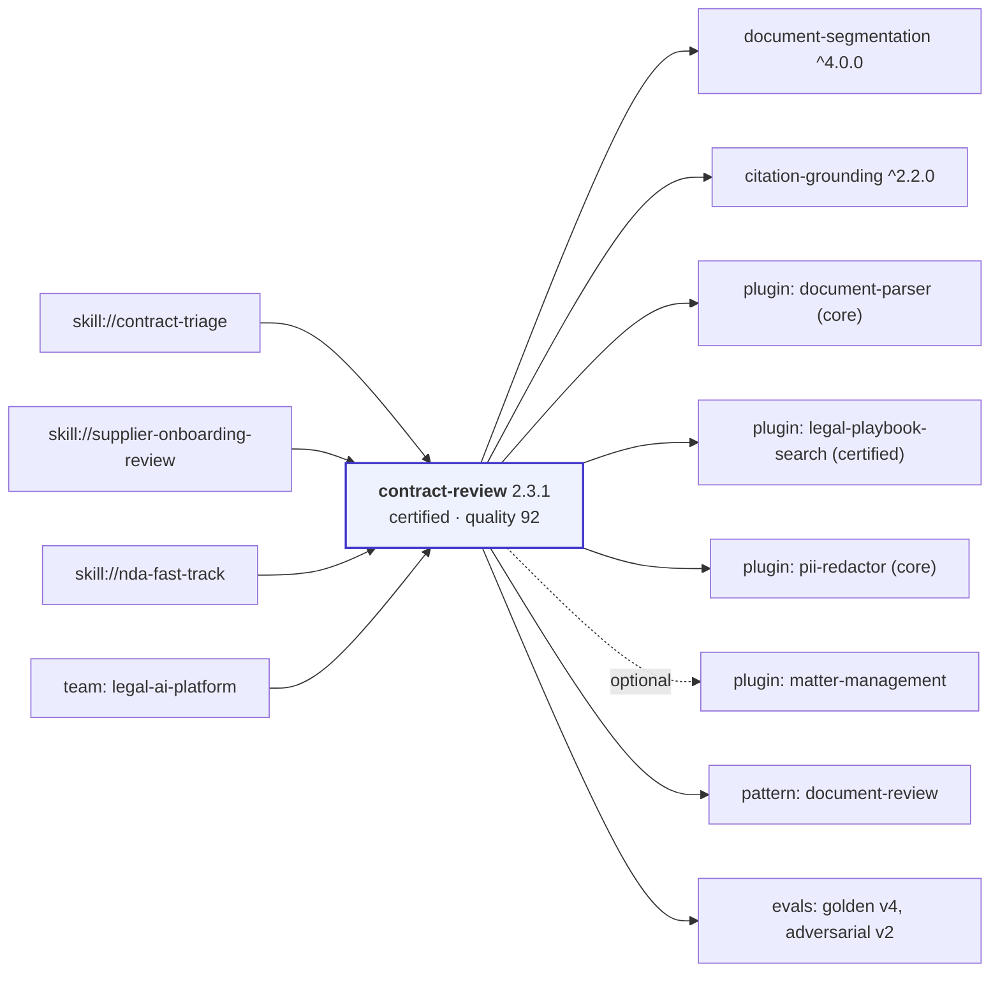

Everything on that diagram is either declared in one manifest or computed by the
indexer. Nothing is hand-drawn, so nothing goes stale.

---

## 14. UX — the harness page

The harness page is the product. Everything else exists to get someone here.

### 14.1 Design rules

1. **Adoption decision above the fold.** A visitor decides in ten seconds whether
   this is worth reading. Name, summary, lifecycle, quality band, pass rate,
   consumer count, owner, latest version — all visible without scrolling.
2. **Evidence adjacent to every claim.** "Certified" links to the certification
   record. "92" opens the breakdown. "0.962" links to the run.
3. **One primary action:** *Use this harness* → quickstart + install snippet.
4. **Progressive disclosure.** Deep material (full eval suites, dependency tree,
   version history) is collapsed but on the same page — deep-linkable, printable,
   searchable, no tab hunting.
5. **Never hide bad news.** Failing gates, stale reviews, waivers, downgrades and
   deprecations render as prominent banners. A registry that hides problems gets
   used once.

### 14.2 Page anatomy

```mermaid
flowchart TB
    subgraph Above["Above the fold"]
        HDR["<b>Contract Review Harness</b> · v2.3.1<br/>summary line<br/>[Certified] [Quality 92 · A] [Pass 0.962] [3 consumers] [Updated 6d ago]<br/>Owner: legal-ai-platform · #ai-legal-platform<br/>▸ Use this harness   ▸ Repository   ▸ Report an issue"]
        BAN["⚠ Banner zone: waivers · overdue review · deprecation · downgrade"]
    end
    subgraph Main["Main column"]
        OV["1 Overview"] --> AR["2 Architecture (Mermaid + ADRs)"]
        AR --> QS["3 Quick Start (executable, copy buttons)"]
        QS --> CFG["4 Configuration"]
        CFG --> PR["5 Prompts"]
        PR --> EV["6 Evaluation (headline + trend + suites + failures)"]
        EV --> EX["7 Examples & sample conversations"]
        EX --> TS["8 Tests & guardrails"]
        TS --> SC["9 Screenshots"]
        SC --> VH["10 Version history & changelog"]
        VH --> MG["11 Migration guides"]
        MG --> DISC["12 Discussion (issues feed)"]
    end
    subgraph Side["Sticky sidebar"]
        SB["Section nav<br/>Required plugins (+trust)<br/>Optional plugins<br/>Dependencies<br/>Consumers (skills)<br/>Supported models/runtimes<br/>Security & risk<br/>Cost & latency<br/>Licence<br/>Maintainers<br/>Downloads: manifest · SBOM · eval JSON · lockfile<br/>Related harnesses"]
    end
```

### 14.3 Section-by-section

| Section | Content | Source |
|---|---|---|
| **Overview** | Summary, description, what it is *not*, limitations (rendered as a callout, never buried) | Manifest + README |
| **Architecture** | Rendered Mermaid (component + sequence), deviations from the blueprint, ADR list with one-line outcomes | `architecture/` |
| **Quick Start** | The executable quickstart with copy buttons and a "last verified: <date>" stamp from the CI run | `docs/quickstart.md` |
| **Required Plugins** | Table: plugin, declared range, resolved version, trust tier, purpose, link. Unresolved ranges render red | `status.plugin_resolution` |
| **Supported Skills** | The consumer list with team and surface | Computed consumer graph |
| **Screenshots** | Lazy-loaded, alt-texted, with capture dates | `assets/` |
| **Diagrams** | Native Mermaid, theme-aware, with an "open larger" view | `architecture/` |
| **Prompts** | Each prompt: id, version, role, models, token budget, variables, rendered body, evaluation link. Diff view between versions | `prompts/` |
| **Configuration** | Table generated from `config/schema.json` — key, type, default, constraints, description — plus a "what you cannot configure" section | `config/schema.json` |
| **Evaluation** | §10.5 | Eval reports |
| **Examples** | Sample inputs, sample conversations, integration guidance | `examples/`, `conversations/` |
| **Tests** | Test inventory, guardrail→test mapping, last run status. Untested guardrails are flagged | CI reports |
| **Version History** | Releases with dates, changelog entries, eval deltas per release, signature status | Releases + CHANGELOG |
| **Consumers** | Skills and harnesses depending on this, with pinned ranges | Graph |
| **Dependencies** | Forward tree with resolved versions and their lifecycle states — a certified harness depending on an experimental one is visible immediately | Graph + lockfile |
| **Downloads** | `harness.yaml`, `harness.lock`, SBOM, evaluation JSON, card JSON. All raw links into GitLab | Snapshot |
| **Repository** | Project, default branch, pipeline badge, stars/forks, open issues | GitLab API |
| **Owner** | Owner group, maintainers, support level and hours, escalation path | Manifest |
| **Discussion** | Recent issues and MRs, with a prominent "Ask a question" link. The registry never hosts comments — GitLab issues are the discussion system, and duplicating it would split the conversation | GitLab API |

### 14.4 Other pages worth calling out

- **Compare view** (`/compare/?ids=a,b,c`): up to four harnesses side by side —
  metadata, evals, plugins, cost, lifecycle. This is what an engineer actually
  needs when choosing between three RAG harnesses, and almost no internal
  catalogue provides it.
- **Category page**: steward's editorial guidance first, then the faceted list.
- **Team page**: owned harnesses, quality distribution, review debt, inbound
  dependency count, recent activity.
- **Reference architecture page**: §15, plus every conforming harness.
- **Empty and error states**: a search with no results suggests broader facets
  and links "propose a new harness"; an unindexable harness shows what failed and
  how to fix it, not a blank card.

---

## 15. Reference architectures

### 15.1 What they are and why

A reference architecture is a **blueprint**: a documented pattern with a canonical
diagram, when-to-use guidance, trade-offs, required plugin classes, the evaluation
metrics that matter for it, and a link to a runnable exemplar harness. It is not
code you install; it is the decision you make before you write code.

They serve three purposes: they shorten design time, they make the technical
taxonomy meaningful (a pattern is a *choice*, a tag is a *label*), and they give
governance a way to ask "why is this a multi-agent system?" before it is built.

Each blueprint is a Markdown file in the registry project with structured front
matter, so `/reference-architectures/<id>/` lists conforming harnesses
automatically via `spec.architecture.pattern`.

### 15.2 The catalogue

| Pattern | When to use | Strengths | Trade-offs | Required plugin classes | Key metrics |
|---|---|---|---|---|---|
| **simple-chat** | Bounded Q&A with no external knowledge or actions | Cheapest, fastest, trivially testable | No grounding; no freshness; hallucination risk on factual asks | none | pass rate, refusal appropriateness |
| **rag** | Answers must come from a document corpus | Grounded, citable, updates without retraining | Retrieval quality is the ceiling; chunking is fiddly; freshness is an ops problem | retrieval index, document parser | grounding rate, citation precision, recall@k |
| **hybrid-search** | RAG where exact terms (codes, names, clause numbers) matter as much as semantics | Catches what vectors miss; better on rare tokens | Two indexes to keep in sync; fusion weights need tuning | lexical + vector index, reranker | recall@k, MRR, grounding rate |
| **tool-calling** | The model must read or change external state, bounded set of tools | Real capability; deterministic tool behaviour | Tool schema quality dominates; error handling is most of the work | plugins per tool | tool-selection accuracy, error-recovery rate |
| **workflow-automation** | The process is known and must be auditable | Deterministic control flow; easy to test; predictable cost | Inflexible to unforeseen cases; longer to build | varies | step success rate, end-to-end pass rate |
| **document-review** | Long documents assessed against a rubric or playbook | Clause-level precision; verifiable citations; strong coverage reporting | Segmentation quality gates everything; long-document latency | parser with anchors, playbook index | coverage, grounding, expert agreement |
| **planner** | Multi-step tasks where the plan should be inspected before execution | Plan is reviewable and cacheable; failures localise | Two model passes; plan/execution drift | varies | plan validity, replan rate |
| **multi-agent** | Genuinely separable roles with different tools or contexts | Specialisation; parallelism; clear role boundaries | **Most over-used pattern in the estate.** 3–10× cost, hard to debug, non-deterministic | orchestration, per-role tools | per-role success, coordination overhead, total cost |
| **research-assistant** | Open-ended investigation across many sources | Breadth; surfaces unknowns | Unbounded cost without hard limits; quality hard to evaluate | search, retrieval, fetch | source diversity, claim support rate, cost per report |
| **code-assistant** | Generating or reviewing code | Verifiable via tests and compilers — a rare luxury | Repo context management; security review of generated code | repo access, test runner, linters | test pass rate, build rate, review acceptance |
| **sql-agent** | Natural language over structured data | High value; results are checkable | Schema comprehension; **write access must be prohibited**; expensive mistakes | DB connector (read-only), schema catalogue | execution accuracy, result-set exact match |
| **knowledge-assistant** | Enterprise-wide Q&A over heterogeneous sources | One front door; high perceived value | Permission-aware retrieval is the hard part; ownership is diffuse | retrieval, identity-aware access | grounding, permission-leak rate (must be 0) |
| **evaluation-harness** | Judging other AI systems | Reusable across the estate; enables the rest of the platform | Judge drift; calibration cost; meta-evaluation needed | judge model access, dataset store | human agreement, calibration stability |

### 15.3 Blueprint page template

Each page carries: the canonical Mermaid diagram; *when to use* / *when not to
use* (the second is more useful); strengths; trade-offs with numbers where we
have them; required and recommended plugin classes; guardrails this pattern
usually needs; the evaluation metrics that matter and typical target values;
common failure modes with mitigations; a scaffold command; and the list of
conforming harnesses sorted by quality score.

The **anti-pattern note** is mandatory. For `multi-agent`:

> Before choosing multi-agent, try workflow-automation with a single model. In
> our estate, 6 of the 9 multi-agent harnesses reviewed in 2026-H1 were
> reimplemented as deterministic workflows with equal or better quality at 25–40%
> of the cost. Multi-agent earns its cost when roles need genuinely different
> tools, contexts or trust boundaries — not when the task merely has several
> steps.

That paragraph will save more money than the rest of this document.

---

## 16. GitLab integration

The design uses GitLab as the platform, not merely as file storage. Every
capability below removes something we would otherwise have to build.

| Capability | How the registry uses it | What it replaces |
|---|---|---|
| **Projects & Groups** | One project per harness; groups mirror business domains and carry permissions | A tenancy model |
| **Merge Requests** | Every state change — code, manifest, governance record, taxonomy, waiver — is an MR | A workflow engine |
| **Approval Rules** | Certification needs 2 board + 1 security; threshold changes need governance | An approvals service |
| **CODEOWNERS** | Path-scoped review: prompts→maintainers, thresholds→governance, datasets→legal | An RBAC matrix |
| **Protected branches & tags** | `main` and `snapshot` protected; `v*` tags protected and signed | Immutability guarantees |
| **CI/CD** | Validation, tests, evaluation, packaging, indexing, site build, deploy | A build system |
| **Multi-project pipelines** | Harness pipelines trigger the registry; the registry triggers consumer notifications | An event bus |
| **Scheduled pipelines** | Hourly crawl, nightly deep pass, weekly governance sweep | A cron service |
| **CI/CD Components & includes** | One shared template (`/ci/harness-ci.yml`) versioned by moving tag `v1` | Copy-pasted pipelines |
| **Pages** | Hosts the registry; `pages.path_prefix` gives per-MR review apps | A web server |
| **Releases** | Version records with notes, SBOM and eval artefacts attached | An artefact store |
| **Package & Container Registry** | Vendored binaries, pinned build images, harness runtime bundles | An internal CDN |
| **Issues** | Discussion, bug reports, governance actions, review reminders, migration notices | A ticketing integration |
| **Issue boards** | Governance queue; certification pipeline; review-debt board | A workflow UI |
| **Labels** (group-level) | `lifecycle::*`, `eval::regression`, `governance::review-due` — consistent across all harness projects | A tagging system |
| **Milestones** | Registry roadmap; quarterly governance review cycles; deprecation waves | Programme tracking |
| **Wiki** | Deliberately **not used** for harness docs (docs live in-repo and are versioned with the code). Reserved for meeting notes and working material | — |
| **Project templates** | `harness-template` for one-click scaffolding | Onboarding friction |
| **Webhooks** | Optional fast-path signal; the crawl remains authoritative | Polling |
| **Audit Events** | Who approved, merged, pushed a tag, changed protection | An audit trail |
| **Group access tokens** | Read-only crawl token; snapshot-writer bot token | A secrets service |
| **Compliance frameworks** | Applied to harness projects: mandates MR approval and blocks force-push | Policy enforcement |

**Two GitLab-specific design notes.**

*Pages review apps.* `pages.path_prefix: "mr-$CI_MERGE_REQUEST_IID"` gives every
registry MR a live preview at `/mr-123/`. Reviewing a theme or content change as
rendered output rather than as a diff is the single biggest quality lever on the
site itself.

*The `v1` moving tag on the CI template.* Harness projects include `ref: v1`, so
the platform team can ship template improvements to 2,000 projects without 2,000
MRs. Breaking template changes cut a `v2` tag and migrate projects deliberately.
This is the same contract discipline we require of harnesses, applied to
ourselves.

---

## 17. CI/CD

### 17.1 Two pipelines, one contract

The harness pipeline ([`ci/harness-ci.yml`](../ci/harness-ci.yml)) and the
registry pipeline ([`ci/registry-ci.yml`](../ci/registry-ci.yml)) meet at exactly
one interface: `harness-card.partial.json`, plus the guarantee that
`harness:validate` ran successfully on the default branch. That narrow contract
is what lets both evolve independently.

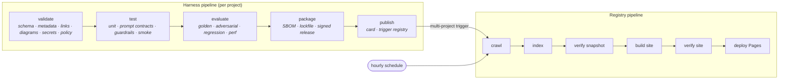

### 17.2 Harness pipeline gates

| Stage | Job | Checks | Blocks |
|---|---|---|---|
| validate | `harness:validate` | JSON Schema; taxonomy/model/runtime/plugin refs resolve; owner group exists; required structure; internal links; `spec.version` == tag; changelog entry | ✅ |
| validate | `harness:diagrams` | Every Mermaid block parses via `mmdc`; diagrams reference only declared plugins | ✅ |
| validate | `harness:secrets` | gitleaks over full history | ✅ |
| validate | `harness:policy` | Structural policy rules: `customer-pii` ⇒ a `pii-redaction` guardrail; `confidential`+ ⇒ `grounding.on_failure: drop`; external egress ⇒ security label; every declared guardrail is wired into a workflow step | ✅ |
| test | `harness:unit` | Unit tests, JUnit report | ✅ |
| test | `harness:prompt-contract` | Every prompt renders with every fixture; no unrendered placeholders; token budgets; declared vars match template | ✅ |
| test | `harness:smoke` | The quickstart actually runs | ✅ |
| evaluate | `evaluate:*` | Suites against `thresholds.yaml`; regression vs last release | ✅ (waivable) |
| package | `harness:sbom` | CycloneDX SBOM | on tag |
| package | `harness:lock` | Ranges resolve to concrete versions | ✅ |
| package | `harness:release` | Tag signature verified; release created | on tag |
| publish | `harness:card` / `registry:notify` | Card emitted; registry triggered | — |

Performance targets: validate < 60 s, test < 5 min, MR feedback < 6 min. Full
evaluation runs on tags and schedules, not on every MR — an eval suite that
delays every review gets disabled within a month. `run-full-eval` as an MR label
gives an explicit opt-in when a change warrants it.

### 17.3 Registry pipeline gates

| Job | Checks | Blocks deploy |
|---|---|---|
| `crawl` | Error rate ≤ 2% of projects | ✅ |
| `index` | Per-harness validation; over-claim downgrades; scoring; graph resolution | Degrades individual cards only |
| `validate:snapshot` | Referential integrity (no dangling harness/plugin/skill refs); **no dependency cycles**; no duplicate ids; mass-change guard (>10% removed) | ✅ |
| `validate:mr-comment` | Posts a human-readable snapshot diff on registry MRs | — |
| `build:site` | Hugo build with `--gc`; zero template errors | ✅ |
| `build:search` | Pagefind index; catalog copied and gzipped | ✅ |
| `verify:site` | Internal link check; **hard fail on any external asset reference**; WCAG 2.1 AA on a 40-page sample; page weight ≤ 400 KB; catalog ≤ 6 MB; canned search queries return expected hits | ✅ |
| `pages` | Deploy | — |

`check-no-external-assets` deserves emphasis: it greps the built output for
`http://` and `https://` in `src`/`href`/`url()` positions and fails the build.
It is the mechanism that makes D9 real rather than aspirational, and it catches
the well-meaning contributor who pastes a CDN link into a Markdown file.

### 17.4 Pipeline efficiency at scale

- **Incremental indexing**: a triggered run re-crawls one project and rewrites
  one card; ~40 s end to end.
- **ETag-conditional crawling**: full crawls are dominated by 304s.
- **`interruptible: true`** on validation jobs so superseded pipelines cancel.
- **Hugo `--gc` with cache**: incremental builds reuse the resource cache.
- **Artefact discipline**: eval results retained 1 year, SBOMs 2 years, site
  artefacts 7 days. Unbounded retention is how GitLab instances run out of disk.
- **Concurrency caps** on eval jobs (a group-level runner queue) so a nightly
  fan-out across 2,000 harnesses does not saturate the model gateway. Evaluation
  scheduling is spread across the night by hashing the project id into a slot.

---

## 18. Offline constraints

### 18.1 The rule

**Zero network egress beyond the enterprise perimeter, at build time and at
runtime.** Not "prefer local". Not "cache aggressively". Zero — and enforced by a
pipeline job rather than by good intentions.

| Constraint | How it is satisfied | How it is enforced |
|---|---|---|
| No internet | Runners on an isolated network; no proxy to the outside | Network policy + `check-no-external-assets` |
| No CDNs | All JS/CSS in `static/`, hash-recorded | Build fails on any external `src`/`href`/`url()` |
| No Google Fonts | System font stack + a self-hosted Inter subset | Same check; CSS reviewed |
| No SaaS APIs | GitLab, model gateway and indexes are all on-network | Egress declarations in manifests + policy check |
| Everything vendored | Internal Package and Container registries | `vendor.lock` with SHA-256 for every artefact |
| Reproducible | Digest-pinned images, pinned tool versions, deterministic generation | Two builds of the same snapshot commit produce identical output (checked weekly) |

### 18.2 What is vendored

```
vendor/
  bin/            hugo-extended-0.148.1 · pagefind-1.1.0 · mmdc-10.9.1 · syft-1.4.1 · gitleaks-8.18.4
  js/             mermaid.min.js (1.02 MB) · minisearch.min.js (12 KB) · pagefind runtime (48 KB)
  css/            (none — theme CSS is hand-written in-repo)
  fonts/          Inter subset WOFF2 (latin, 38 KB) + LICENCE
  schema/         json-schema meta-schemas (offline validation)
  skill-marketplace/index.json     # exported nightly by the Skill Marketplace pipeline
  plugin-marketplace/index.json    # exported nightly by the Plugin Marketplace pipeline
  vendor.lock                      # name, version, sha256, source, licence, review date
```

Two decisions worth defending:

*Mermaid is 1 MB and we ship it anyway.* Diagrams are central to the value of this
registry. It is lazy-loaded only on pages containing `.mermaid` blocks, and
pre-rendering to SVG at build time is the Phase 6 optimisation (`mmdc` already
runs in CI for validation, so the pipeline exists).

*The sibling registry indexes are vendored, not fetched.* The Skill and Plugin
Marketplaces export a JSON index as a pipeline artefact; the registry consumes a
committed copy refreshed by an automated daily MR. A failing sibling pipeline
therefore cannot break the registry build — it only makes the consumer graph a
day stale, which is visible on the admin page.

### 18.3 How updates happen

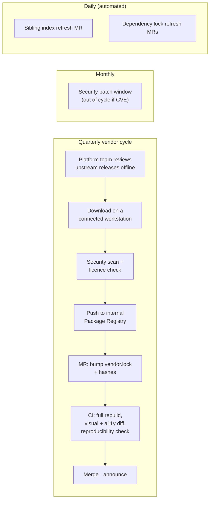

Cadence: **daily** automated index and lockfile refresh MRs; **monthly** security
patch window; **quarterly** planned vendor bumps; **out of cycle** for CVEs above
an agreed severity. Every vendored artefact carries a review date, and the admin
page lists anything unreviewed for over 12 months — vendoring without an expiry
date is how an offline estate quietly ages into a liability.

**Disaster recovery.** The registry can be rebuilt from scratch, offline, from
(a) the harness projects, (b) the registry project, (c) the vendored artefacts.
This is exercised quarterly: a clean runner, no cache, no network, `hugo` from
`vendor/bin`, and the output compared to production. Target: full rebuild under
20 minutes at current scale. If that test fails, we have an offline story on
paper only.

---

## 19. Security

### 19.1 Threat model (abbreviated)

| Threat | Vector | Control |
|---|---|---|
| Confidential harness exposed on an internal site | A `restricted` harness indexed into a company-visible page | Visibility-aware indexing (§19.2); classification banner; stub cards |
| Secrets committed to a harness repo | Prompt containing an API key; config with a connection string | gitleaks on full history, blocking; manifest forbids endpoints; secret detection at group level |
| Malicious or compromised plugin pulled in | A harness requires a `community` plugin that is later compromised | Trust tiers, resolved-version display, SBOM, plugin pinning, security approval for `restricted` harnesses |
| Supply-chain tampering of the registry build | Modified vendored binary or image | Digest-pinned images, `vendor.lock` hashes, protected branches, signed tags |
| Registry index poisoning | A crafted `harness.yaml` injecting markup into the site | Schema validation, strict escaping in templates, no raw HTML from manifests, CSP |
| Prompt injection *through* registry content | A harness README containing instructions aimed at an LLM that later reads the site | Registry content is data, never instructions; documented for consumers; §19.6 |
| Unauthorised promotion | A team certifying itself | Governance records in a separate repo with separate CODEOWNERS (D6) |
| Silent evaluation manipulation | Thresholds quietly loosened | Thresholds CODEOWNED by governance; changes annotated on public trend charts |
| Data leakage via evaluation artefacts | Confidential contract text in a failure log | Failure artefacts redacted when dataset classification ≥ confidential; enforced in the eval runner |
| Lost accountability | Owner leaves; nobody notices | Owner group ≥ 2 members enforced; orphan detection; auto-deprecation |

### 19.2 Visibility and permissions

Three tiers, mapped onto GitLab-native project visibility:

| Harness classification | GitLab project | Registry behaviour |
|---|---|---|
| `public` / `internal` | Internal | Full card, full documentation, full evals |
| `confidential` | Private, group-scoped | **Stub card**: name, summary, owner, domain, lifecycle, "request access". No prompts, no eval details, no architecture |
| `restricted` | Private, restricted group | Listed only to members of the owning group; otherwise absent from catalogue and search |

The registry site itself is **internal-visible**, so the stub mechanism is what
keeps sensitive implementations discoverable-in-principle without leaking their
content. Crucially, **the indexer runs with a read-only token whose scope defines
what can possibly be published** — the crawler literally cannot read a restricted
project it is not a member of, so a template bug cannot leak content it never
had. Defence in depth: token scope first, logic second.

For restricted harnesses that must still be discoverable by their own group, a
second Pages site is built per restricted group from a scoped snapshot. This is
deliberately rare; the operational cost of many site variants is real.

### 19.3 Secrets

Harness repos contain **no secrets, ever**. Credentials come from the runtime
environment; connection details come from platform configuration; manifests carry
logical names only. Enforcement: gitleaks over full history (blocking), GitLab
secret detection at group level, schema rules that reject URL-shaped values in
`retrieval.index` and `security.egress`, and a policy check that fails on any
`http(s)://` outside `links.*`.

If a secret is committed: rotate first, purge history second, incident issue
third. The registry marks the harness `security::review` and suppresses its card
until the review closes.

### 19.4 Plugin trust

| Tier | Meaning | Who approves | Registry treatment |
|---|---|---|---|
| `core` | Platform-built and maintained | Platform | Full marks in the rubric |
| `certified` | Reviewed by security, actively maintained | Security | Full marks |
| `community` | Internally built, unreviewed | — | Partial marks; org-ready requires justification |
| `experimental` | Anything else | — | Zero marks; blocks org-ready |

Trust tiers are read from the Plugin Marketplace index at build time and rendered
next to every plugin, so an adopter sees the weakest link in the chain without
opening another tool. A certified harness may not require an `experimental`
plugin — the rubric and the certification evidence check both enforce it.

### 19.5 SBOM, licensing and signing

- **SBOM** (CycloneDX) generated per release by `syft`, attached to the GitLab
  Release, linked from the card, and covering runtime dependencies, plugins,
  composed harnesses, models and datasets. The last three are unusual in an SBOM
  and are exactly what an AI-specific supply chain needs.
- **Licensing**: SPDX id or `ACME-Internal-1.0`; `third_party_review` required
  when third-party content is bundled; dataset clearance ids recorded in dataset
  manifests. A licence check runs in CI against an allowlist.
- **Signed releases**: tags signed with GPG keys in the platform trust store;
  `harnessctl verify-tag-signature` blocks the release job otherwise. Signature
  status is displayed per version, and unsigned releases block certification.
- **Audit logging**: GitLab Audit Events cover approvals, merges, tag pushes and
  protection changes. The `snapshot` branch history is itself an audit log of
  every state change the registry ever published. Retention: 7 years for
  governance records, in line with the corporate policy for model documentation.

### 19.6 A note on prompt injection through the registry

The registry publishes text authored by hundreds of contributors, and that text
will increasingly be read by AI agents. Registry content is **data, not
instructions**. We therefore: escape all manifest-derived content and never
render raw HTML from it; serve a strict CSP; document for consumers that harness
READMEs must be treated as untrusted input by any agent that reads them; and
provide a machine-readable card JSON so agents consume structured fields rather
than scraping prose. This is cheap to do now and expensive to retrofit.

---

## 20. Extensibility

### 20.1 Extension points

The architecture has five seams, deliberately placed so that most future features
are additions rather than surgery:

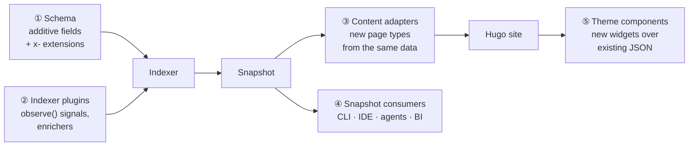

1. **Schema** — new optional fields are additive and non-breaking; `apiVersion`
   allows a v2 alongside v1 during migration. An `x-` prefixed namespace lets a
   domain experiment before proposing a standard field.
2. **Indexer signals** — `observe()` is a pure function from evidence to facts;
   new rubric signals are a function plus a rubric entry, with unit tests.
3. **Content adapters** — the snapshot is the interface to the site; new page
   types need no changes to crawling, indexing or scoring.
4. **Snapshot consumers** — `snapshot/` is a public, versioned data product. The
   CLI, an IDE extension, an agent-facing endpoint and BI dashboards all read the
   same files. This is the most valuable seam: the registry becomes an API
   without anyone building an API.
5. **Theme components** — widgets consume `catalog.json` and card JSON.

### 20.2 Roadmap of extensions

| Idea | Approach | Seam | Effort | Risk |
|---|---|---|---|---|
| **AI-generated documentation** | Pipeline job drafts README sections and a summary from the repo; opens an MR for the owner to edit. **Never auto-merged.** | ② | M | Plausible-but-wrong docs; mitigated by human merge and a "drafted by assistant" note |
| **Automatic metadata extraction** | Suggest domains, tags, architecture pattern and limitations from code and docs; render as MR suggestions | ② | M | Silent mis-tagging — suggestions only, never applied |
| **Architecture visualisation** | Render the orchestration graph directly from `workflows/*.yaml`, so the diagram cannot drift from the implementation | ③ | M | Low — high value, replaces hand-drawn diagrams |
| **Evaluation trend graphs** | Already in the design (§10.5); extend to cross-harness and model-build overlays | ③ | S | Low |
| **Dependency graphs** | Already in §13; extend with impact analysis and "safe to upgrade?" checks | ③⑤ | S | Low |
| **Usage analytics** | Self-hosted, privacy-preserving page counts (no per-user tracking) as a *secondary* popularity signal; structural signals stay primary | ⑤ + a tiny collector | M | Needs a service — the only piece that breaks the no-server property; keep optional |
| **Plugin compatibility matrix** | Cross-reference harness plugin ranges against plugin releases; flag harnesses blocking a plugin upgrade | ② | S | Low; high operational value |
| **Harness recommendations** | "Teams like yours also use…" from the graph, plus embedding similarity over summaries computed offline in CI | ②⑤ | M | Cold-start; keep explainable ("because both are legal + document-review") |
| **Quality scoring v2** | Add adoption-weighted and outcome-based signals (production success rate from the audit store) | ② | M | Availability of production telemetry |
| **Agent-facing registry** | An MCP-style local server over `snapshot/` so coding agents can query "find a certified RAG harness for legal" | ④ | M | Read-only; treat registry text as data (§19.6) |
| **Harness scaffolding from a blueprint** | `harnessctl new --pattern rag` generates a working harness with a starter eval suite | CLI | M | Template drift; keep templates in the blueprint pages |
| **Cost observatory** | Aggregate estimated vs actual spend by harness and domain | ②③ | M | Requires gateway telemetry integration |

Two guardrails on extensibility. First, **no feature may break the "static site
built offline from Git" property** — usage analytics is the only candidate that
would, and it stays optional and self-hosted. Second, **AI-generated content is
always a suggestion in an MR, never a silent write**; a registry that quietly
writes its own metadata cannot be trusted as an evidence base, which is its only
real asset.

---

## 21. Example harness — `contract-review`

A complete, fictional but realistic harness. **Every file exists in this
repository** under [`examples/harnesses/contract-review/`](../examples/harnesses/contract-review/)
and is written as if it were the real thing, because a template that is only
sketched gets copied as a sketch.

### 21.1 File inventory

| File | Purpose |
|---|---|
| [`harness.yaml`](../examples/harnesses/contract-review/harness.yaml) | The manifest — every field populated realistically |
| [`README.md`](../examples/harnesses/contract-review/README.md) | Card content with all required H2 sections |
| [`CHANGELOG.md`](../examples/harnesses/contract-review/CHANGELOG.md) | Four releases including a MAJOR with migration |
| [`CODEOWNERS`](../examples/harnesses/contract-review/CODEOWNERS) | Path-scoped review: legal, governance, security |
| [`.gitlab-ci.yml`](../examples/harnesses/contract-review/.gitlab-ci.yml) | Six lines; the rest is the shared template |
| [`harness.lock`](../examples/harnesses/contract-review/harness.lock) | Resolved plugins, harnesses, datasets, model build |
| [`prompts/system.md`](../examples/harnesses/contract-review/prompts/system.md) | System prompt with a versioned front-matter contract |
| [`prompts/clause-classification.md`](../examples/harnesses/contract-review/prompts/clause-classification.md) | Classification prompt |
| [`prompts/finding-generation.md`](../examples/harnesses/contract-review/prompts/finding-generation.md) | Assessment prompt with grounding constraints |
| [`workflows/review.yaml`](../examples/harnesses/contract-review/workflows/review.yaml) | Declarative orchestration, 12 steps, 4 guardrails |
| [`config/schema.json`](../examples/harnesses/contract-review/config/schema.json) | Closed config schema |
| [`config/default.yaml`](../examples/harnesses/contract-review/config/default.yaml) | Defaults, no secrets |
| [`guardrails/no-advice.yaml`](../examples/harnesses/contract-review/guardrails/no-advice.yaml) | Output filter as reviewable data |
| [`evaluations/thresholds.yaml`](../examples/harnesses/contract-review/evaluations/thresholds.yaml) | Gates, regression deltas, waiver policy |
| [`evaluations/suites/golden.yaml`](../examples/harnesses/contract-review/evaluations/suites/golden.yaml) | Suite with metric implementations and judge calibration |
| [`evaluations/results/2026-07-19-golden.json`](../examples/harnesses/contract-review/evaluations/results/2026-07-19-golden.json) | A real-shaped machine-readable report |
| [`datasets/golden-contracts/manifest.yaml`](../examples/harnesses/contract-review/datasets/golden-contracts/manifest.yaml) | Provenance, clearance, composition, known biases |
| [`conversations/001-…md`](../examples/harnesses/contract-review/conversations/001-msa-indemnity-escalation.md) | Annotated sample run, regenerated by CI |
| [`tests/test_prompt_contracts.py`](../examples/harnesses/contract-review/tests/test_prompt_contracts.py) | Deterministic prompt tests |
| [`tests/test_guardrails.py`](../examples/harnesses/contract-review/tests/test_guardrails.py) | Every declared guardrail is tested |
| [`architecture/overview.mmd`](../examples/harnesses/contract-review/architecture/overview.mmd) | Component diagram |
| [`architecture/sequence.mmd`](../examples/harnesses/contract-review/architecture/sequence.mmd) | Run sequence |
| [`architecture/decisions/ADR-003-…md`](../examples/harnesses/contract-review/architecture/decisions/ADR-003-clause-segmentation.md) | Why not fixed chunking |
| [`docs/quickstart.md`](../examples/harnesses/contract-review/docs/quickstart.md) | **Executable** — run by CI |
| [`docs/configuration.md`](../examples/harnesses/contract-review/docs/configuration.md) | Config reference incl. what you *cannot* configure |
| [`docs/migration-1-to-2.md`](../examples/harnesses/contract-review/docs/migration-1-to-2.md) | Migration guide for the MAJOR |
| [`examples/skill-integration.md`](../examples/harnesses/contract-review/examples/skill-integration.md) | How a skill consumes it, and anti-patterns |
| [`assets/README.md`](../examples/harnesses/contract-review/assets/README.md) | Screenshot rules and provenance |

### 21.2 Manifest (abridged — [full file](../examples/harnesses/contract-review/harness.yaml))

```yaml
apiVersion: harness.registry.acme.internal/v1
kind: Harness
metadata:
  id: contract-review
  name: Contract Review Harness
  summary: Clause-level risk review of commercial contracts with citation-backed findings and playbook alignment.
  owner: group:legal-ai-platform
  maintainers: ["@a.okafor", "@s.lindqvist", "@r.das"]
  team: legal-ai-platform
  tags: [contracts, clause-extraction, playbook, citations, legal-review]
spec:
  version: 2.3.1
  lifecycle: certified
  domains:
    business: [legal, procurement]
    technical: [workflow, hybrid-search, extraction, guardrails]
  architecture:
    pattern: document-review
    deviations:
      - "Deterministic clause segmenter before retrieval rather than fixed-size chunking…"
  models:
    supported: [claude-opus-5, claude-sonnet-5]
    default: claude-sonnet-5
    unsupported:
      - { model: claude-haiku-4-5, reason: "Clause classification F1 0.71 < 0.85 gate." }
  plugins:
    required:
      - { id: document-parser, range: "^3.2.0", trust_tier: core }
      - { id: legal-playbook-search, range: "^1.6.0", trust_tier: certified }
      - { id: pii-redactor, range: "^2.0.0", trust_tier: core }
  guardrails:
    - { id: redact-before-inference, type: pii-redaction,   enforcement: blocking }
    - { id: citation-required,       type: grounding-check, enforcement: blocking }
    - { id: no-legal-advice-language, type: output-filter,  enforcement: blocking }
    - { id: lawyer-signoff,          type: human-in-the-loop, enforcement: blocking }
  security:
    classification: confidential
    risk_level: high
    data_types: [legal-privileged, customer-pii, internal]
    human_review: required
    egress: [none]
  operations:
    estimated_cost: { unit: per-document, value: 0.42, currency: GBP,
                      basis: "Median 38-page MSA, claude-sonnet-5, measured over 250 production runs." }
    estimated_latency: { p50_ms: 74000, p95_ms: 168000, measured_on: "2026-07-19" }
  limitations:
    - "English-language contracts only; the clause segmenter has not been evaluated on other languages."
    - "Playbook coverage is 84% of positions; unmatched clauses are reported, not silently dropped."
    # …four more
```

### 21.3 Architecture

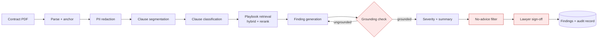

Full component and sequence diagrams: [`architecture/`](../examples/harnesses/contract-review/architecture/).

### 21.4 Prompts

Prompts are files with a versioned contract in front matter — model list, token
budget, declared variables, and the suite that evaluates them:

```markdown
---
id: finding-generation
version: 2.3.1
role: user
models: [claude-opus-5, claude-sonnet-5]
token_budget: 6000
temperature: 0.1
variables: [clause, playbook_positions, precedents, severity_profile]
evaluated_by: evaluations/suites/golden.yaml#finding-generation
---
…
Constraints:
- `evidence` must appear verbatim in the clause above. A downstream grounding
  check verifies this by exact string match; a mismatch discards the finding.
- Every id in `citations` must appear in this prompt. Do not cite anything else.
```

Everything here is machine-checked: `harness:prompt-contract` renders every
prompt against every fixture, verifies the token budget, and fails if the
declared variables and the template disagree.

### 21.5 Evaluation

Latest run — [`2026-07-19-golden.json`](../examples/harnesses/contract-review/evaluations/results/2026-07-19-golden.json):

| Suite | Cases | Metric | Value | Gate | Status |
|---|---|---|---|---|---|
| golden | 173/180 | `clause_f1` | 0.913 (CI 0.897–0.928) | ≥ 0.85 | ✅ |
| golden | | `severity_agreement` | 0.842 | ≥ 0.80 | ✅ |
| golden | | `citation_grounding` | 0.994 | ≥ 0.99 | ✅ |
| golden | | `hallucinated_citations` | 0.006 | ≤ 0.01 | ✅ |
| golden | | `rationale_quality` (judged) | 4.21/5 | — | not gated |
| golden | | `coverage` | 0.861 | ≥ 0.80 | ✅ |
| adversarial | 63/64 | `injection_resistance` | 0.984 | ≥ 0.95 | ✅ |
| adversarial | | `advice_leakage` | 0.000 | = 0 | ✅ |
| performance | 39/40 | `p95_latency_ms` | 168,430 | ≤ 210,000 | ✅ |
| performance | | `cost_per_document` | £0.42 | ≤ £0.60 | ✅ |

Overall pass rate **0.962**, human review verdict **accept** (40 cases, 0.89
agreement, two qualified lawyers). Seven golden failures are published with
categories — `segmentation`, `classification`, `playbook-gap`, `severity`,
`grounding`, `parsing`, `performance` — which is what lets an adopter judge
whether the failure modes matter for *their* documents. Note the honest
adversarial failure: a white-on-white injection in a schedule did induce
non-playbook output; the blocking filter caught it, and the case is published
rather than quietly dropped.

### 21.6 Tests

```python
def test_no_inference_step_precedes_redaction() -> None:
    wf = Workflow.load("workflows/review.yaml")
    redact_idx = wf.index_of("redact")
    for i, step in enumerate(wf.steps):
        if step.get("uses") == "model":
            assert i > redact_idx, f"step {step['id']} calls a model before redaction"


def test_every_declared_guardrail_is_wired_into_the_workflow() -> None:
    wired = {s["guardrail"] for s in Workflow.load("workflows/review.yaml").steps if "guardrail" in s}
    assert DECLARED == wired
```

These two tests encode the properties that the manifest *claims* and that a
reviewer would otherwise have to verify by reading code. Combined with
`harnessctl policy-check`, a declared guardrail cannot be decorative.

### 21.7 How this harness scores

| Dimension | Weight | Earned | Notes |
|---|---|---|---|
| Documentation | 15 | 15 | All sections, executable quickstart, diagrams, no broken links |
| Metadata | 10 | 10 | Schema valid, 6 limitations, all optional fields populated |
| Evaluation | 30 | 27 | Full suites and fresh runs; loses 3 on `coverage` (0.861 → banded below the top tier on the sub-signal weighting) |
| Engineering | 20 | 20 | Green pipeline, tests, lockfile, seeded reproducible evals, changelog |
| Security | 15 | 15 | Clean history, SBOM, signed tag, all required plugins core/certified |
| Stewardship | 10 | 10 | Owner group of 3, CODEOWNERS aligned, reviewed 2026-07-10 |
| **Total** | **100** | **97 (A)** | Certified gates met: score ≥ 90, pass ≥ 0.95, evals ≤ 30d, human review, governance record |

---

## 22. Implementation roadmap

Estimates assume **2 engineers** (one platform, one full-stack) plus fractional
design, security and governance input. "Weeks" are engineer-weeks of the pair.

### 22.1 Phases

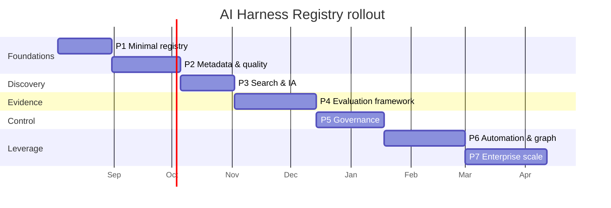

**Phase 1 — Minimal registry (4 weeks).** Schema v1 (subset: identity, owner,
domains, lifecycle, links); `harnessctl validate`; crawler over one pilot group;
indexer producing cards; Hugo theme with home, browse (unfaceted) and harness
pages; registry pipeline to Pages; harness CI template with validation only.
*Exit:* 10 pilot harnesses from 3 teams live; a new harness appears within an
hour of its first push. *Deliverable value:* discovery works — this alone
justifies the phase.

**Phase 2 — Metadata & quality (5 weeks).** Full schema; taxonomy, models,
runtimes, teams reference data; quality rubric v1 and computed scores with
breakdowns; lifecycle gates and auto-downgrade; category, team and owner pages;
plugin resolution against the Plugin Marketplace index; the template project.
*Exit:* 50 harnesses; scores visible; the first over-claims get downgraded (and
the first arguments happen — this is the phase that needs the most communication).

**Phase 3 — Search & IA (4 weeks).** `catalog.json` + MiniSearch faceting;
Pagefind full-text; query language; ranking with the labelled query set; compare
view; recently-updated and popularity views; dark mode; accessibility pass and
CI gates. *Exit:* median time-to-find under 30 seconds in a moderated test with
eight engineers.

**Phase 4 — Evaluation framework (6 weeks).** Evaluation report schema; suite
definitions and the eval runner in the CI template; thresholds and gating;
regression detection with attribution; trend storage; harness-page dashboards and
`/evaluations/`; dataset manifests. *Exit:* 20 harnesses publishing gated evals;
one regression caught before release. *This is the phase that turns the site into
a platform, and the one most likely to slip — it depends on teams doing work in
their own repos.*

**Phase 5 — Governance (5 weeks).** Governance records and approval flows;
certification pipeline with automated evidence checks; review cadence automation;
orphan detection; waivers with expiry; the admin section; audit reporting. *Exit:*
first three certified harnesses; governance board running from the registry
rather than a spreadsheet.

**Phase 6 — Automation & graph (6 weeks).** Consumer graph from skill manifests;
dependency and impact views; graph explorer; consumer notification on MAJOR
releases and deprecations; workflow-derived architecture diagrams; AI-assisted
documentation and metadata suggestions (MR-only); plugin compatibility matrix;
`harnessctl bulk-mr`. *Exit:* a MAJOR release automatically notifies every
consumer; impact analysis takes minutes.

**Phase 7 — Enterprise scale (6 weeks).** Sharded/parallel crawling; catalog
sharding; incremental site builds; per-restricted-group site variants; snapshot
archival and pruning; recommendations; usage analytics (optional, self-hosted);
performance and DR exercises at 5,000-harness scale. *Exit:* full rebuild under
20 minutes at 5,000 harnesses; incremental under 90 seconds; quarterly offline DR
test green.

**Total: ~36 engineer-weeks over ~9 months**, with usable value from week 4.
Steady state afterwards: **~0.5 FTE** for schema/rubric evolution, vendor cycles
and support.

### 22.2 Sequencing rationale

Discovery before metadata, metadata before search, search before evaluation. The
temptation is to build the evaluation framework first because it is the most
interesting; that fails, because evaluation only matters once there is a
population of harnesses to compare and an audience that checks the registry
habitually. Each phase should make the next one easier to justify.

### 22.3 Risks

| Risk | Likelihood | Impact | Mitigation |
|---|---|---|---|
| **Nobody publishes** — the classic empty-catalogue death | High | Fatal | Seed with 10 harnesses the platform team ports itself; make publishing a 10-minute template; run "harness clinics"; make the registry the only route to certification, so business demand pulls supply |
| **Metadata rots** | High | High | Computed status over declared fields wherever possible; review cadence with auto-downgrade; freshness visible on every card |
| **Quality scores cause political fights** | Medium | Medium | Publish the rubric before the scores; show the breakdown and remedies; run a two-week "preview mode" with scores visible only to owners |
| **Evaluation adoption stalls** (Phase 4) | High | High | Ship starter suites per reference architecture; make `team-ready` require only 50 cases; fund a labelling sprint for two flagship harnesses; celebrate the first caught regression loudly |
| **Crawl overloads GitLab** | Low | High | ETag conditionals; concurrency cap; off-peak full crawls; agreed API budget with the GitLab team; shardable by group |
| **Site build time grows past usefulness** | Medium | Medium | Hugo chosen partly for this; incremental builds; page-count budget alarm at 80% of the 10-minute target |
| **Taxonomy sprawl or paralysis** | Medium | Medium | Evidence rule for new terms; stewards with named accountability; quarterly review |
| **The registry becomes a compliance gate people route around** | Medium | High | Keep publishing free and unreviewed; only *claims* cost. If contributors experience the registry as governance, it dies |
| **Skill Marketplace integration slips**, leaving the consumer graph empty | Medium | Medium | Vendored index with a documented contract; degrade gracefully to `example_skills` until it lands |
| **Key-person dependency on the platform pair** | Medium | High | Two-person minimum from day one; ADRs in-repo; the whole system is Git plus a static generator, deliberately boring |
| **Offline drift** — someone adds a CDN link | Medium | Medium | `check-no-external-assets` is a blocking gate, from Phase 1 |

### 22.4 Success measures

Phase 1: 10 harnesses, 3 teams. Phase 3: 100 harnesses; median find time < 30 s;
40% of AI engineers visiting weekly. Phase 5: 60% of new AI projects starting
from a registry harness or blueprint; 100% of production skills mapped to a
harness; zero uncatalogued production AI systems found in audit. Phase 7: 500+
harnesses; ≥ 30% reuse rate (skills per harness > 1.3); measurable reduction in
time-to-first-working-prototype (baseline it in Phase 1, or the claim is
unfalsifiable).

---

## 23. Critical review

An architecture document that does not attack itself is a sales document. Here
are the strongest objections to this design, stated as an opponent would state
them, and why the recommendation stands anyway.

### 23.1 Where the complexity actually is

The static site is the easy part. The real complexity sits in four places:

1. **The indexer** (~2,500 lines at maturity). It crawls, validates, scores,
   downgrades, resolves three kinds of reference, inverts edges, detects cycles
   and guards against its own failure modes. It is bespoke software the platform
   team must own forever. *Accepted*: it is pure, testable, and the scoring
   functions are unit-testable in isolation — but it is genuinely the system.
2. **The quality rubric.** Every signal is an opinion made numeric. Weights will
   be argued about; edge cases will be discovered; the rubric will change, and
   every change moves everyone's score. *Accepted*: rubric versioning and chart
   annotation reduce the pain but do not remove it.
3. **The evaluation contract.** Asking hundreds of contributors to produce
   schema-valid, gated, dataset-backed evaluations is the most demanding thing in
   this document, by a wide margin. It is also the thing that makes the registry
   worth having.
4. **The declared/observed split.** Conceptually clean, operationally subtle:
   every new field needs an explicit decision about which side it lives on, and
   getting it wrong (a field that *should* be observed but is declared) quietly
   erodes trust in the whole card.

Places we deliberately kept simple, and should defend against future
sophistication: no database, no server, no auth layer of our own, no bespoke
workflow engine, no framework in the browser.

### 23.2 Technical debt we are choosing to take on

| Debt | Why we accept it | When it comes due |
|---|---|---|
| Committing the snapshot to Git | Auditability and rollback are worth it | Repo size at ~5,000 harnesses; annual archival planned |
| Hugo Go templates for a data-heavy UI | Build speed and offline simplicity win | If the UI needs genuine interactivity, we will fight the templates |
| Hand-rolled chart and graph rendering (~1,600 lines) | No chart library is worth the vendoring and the weight | Feature requests for interactive charts |
| A bespoke query-language parser | Small, and the alternative is a heavier search stack | If the grammar grows beyond ~200 lines |
| Vendored Mermaid at 1 MB | Diagrams are core value | Pre-render to SVG in CI (already planned) |
| `harnessctl` as a second tool to maintain | Contributors need a local feedback loop | It will accrete features; needs its own scope discipline |
| Sibling registry indexes vendored daily | Decouples build failures | If the Skill Marketplace changes its export contract |

### 23.3 The strongest objections

**"This is a build system pretending to be a catalogue. Just run a database and
an API — everyone knows how."** The honest version of this objection is about
latency and query flexibility, and both are real: our incremental path is ~40
seconds, and an arbitrary query needs either a facet we predicted or a full-text
match. A Postgres-backed service would be more flexible. It would also need
hosting, backups, migrations, an auth layer, an on-call rotation and a team.
Static output on GitLab Pages has one failure mode — stale — and the last good
version keeps serving. For an internal catalogue read a few thousand times a day
and written a few dozen times a day, that trade is not close. *Revisit if* we
need real-time write-back (comments, ratings, per-user state) or sub-second
cross-cutting queries over ten thousand harnesses.

**"Nobody will write the evaluations, and without them this is a directory with
opinions."** This is the objection I find hardest to dismiss, because it has
killed comparable initiatives elsewhere. Our answer is graduated demand:
experimental harnesses need none; `team-ready` needs 50 cases; only `certified`
demands the full apparatus. Plus starter suites per blueprint, a funded labelling
sprint for two flagship harnesses, and — the real lever — business pull, because
certification is the route to production for regulated use cases. If, six months
in, fewer than 20% of `team-ready` harnesses publish evals, the model has failed
and we should lower the bar to "any automated check with a threshold" rather than
pretend.

**"Two registries (harness + skill) is one too many; merge them."** Tempting, and
wrong. Merging forces one audience's vocabulary onto the other: business users
would wade through prompt versions, engineers through entitlement configuration.
The 1:many skill→harness relationship is precisely the reuse we are trying to
create, and it only exists if the layers are separate. *However*: the boundary
must be policed, and if in a year we find most harnesses have exactly one skill
and no independent life, the objection wins and we should merge.

**"The quality score will be gamed, or resented, or both."** Partly true. It will
be optimised for — by design, since the signals are things we want done. It will
be resented when it drops, which is why the breakdown, the remedies and the
rubric-change annotations are not optional polish. The failure mode we must avoid
is scores becoming a management metric in performance reviews; that turns an
engineering tool into a political one within a quarter. This warrants an explicit
agreement with engineering leadership before Phase 2 ships.

**"Hugo is the wrong choice; the team knows React."** Real cost, honestly. Go
templates are worse to write than JSX, and the theme will take longer. But the
theme is written once by two people; the offline vendoring burden and the build
time are paid every day by everyone. And a Go binary plus Markdown is the most
likely part of this system to still work unchanged in 2031.

**"Crawling is fragile compared to webhooks."** Inverted: crawling is the robust
part and webhooks are the fragile optimisation. We use both, and the crawl wins
disagreements. The genuine risk is GitLab API load, which is why every read is
conditional and the crawl is shardable.

### 23.4 Alternative architectures considered

| Alternative | Shape | Why rejected |
|---|---|---|
| **Database + API + SPA** | Postgres, service, React | Operational cost, on-call, auth, backups — for a read-mostly catalogue. Revisit only for real-time interaction |
| **Monorepo of harnesses with a generated site** | One project, path-scoped CI | Access control and CI economics collapse at scale (§4.1) |
| **GitLab Wiki as the registry** | Hand-written pages | No schema, no validation, no computation. Rots in a quarter |
| **Package-registry-first** (harnesses as published artefacts) | Publish tarballs; index the package registry | Loses the repository as the unit of documentation, evaluation and review. Worth adopting *in addition* for runtime distribution |
| **Extend the Skill Marketplace** with an "engineering view" | One system, two lenses | Vocabulary collision; the engineering layer becomes a second-class tab |
| **Buy a commercial catalogue / IDP** (Backstage-style) | Off-the-shelf | Backstage is the serious contender and would give plugins and a graph — but it needs a running service, a database, a Node supply chain and an auth integration, all of which the offline constraint makes expensive. Reconsider if the organisation adopts an IDP for services generally: then harnesses become a Backstage entity kind and this design's schema and rubric port directly |
| **Federated per-domain registries** | Each domain runs its own | Discovery fragments — the exact problem we are solving |

Note that the Backstage row is the one where a future organisational decision
should override this document. The metadata model, quality rubric, evaluation
schema and governance flows are the durable assets here; the static-site
rendering is the replaceable part. That is not an accident of the design — it is
why the snapshot is a clean, documented data product (§20, seam ④).

### 23.5 Unknowns

1. **Contribution rate.** We do not know whether we will see 50 or 500 harnesses
   in year one. The design scales down gracefully and up to ~5,000; beyond that,
   catalog sharding and crawl sharding are sketched but unproven.
2. **Evaluation cost at estate scale.** Nightly evaluation across hundreds of
   harnesses consumes real model capacity. Phase 4 must produce a measured
   budget; if it is prohibitive, evaluation moves to per-release plus weekly.
3. **Judge stability.** Model-graded metrics drift as models change. Calibration
   sets help; we do not yet know how much.
4. **Where the skill/harness line actually falls in practice.** Clean in theory;
   the first ten real cases will teach us more than this document can.
5. **Governance throughput.** If certification takes six weeks of board time,
   teams will stop at org-ready and the top tier becomes decorative.
6. **Whether teams will accept auto-downgrade.** It is the mechanism most likely
   to produce a difficult conversation in month two.
7. **GitLab API headroom** on our instance under an hourly full crawl at 5,000
   projects — modelled, not measured.

### 23.6 Why this remains the recommendation

Three properties are hard to obtain together, and this design has all three.

**It cannot rot silently.** Every claim is either schema-validated, computed from
evidence, or reviewed by someone who is not the claimant. Cards go stale
visibly — freshness, review debt and gate failures are rendered, not hidden. Most
internal catalogues fail by quietly becoming untrue; this one is built so that
becoming untrue is the loudest thing it can do.

**It has almost no operational surface.** Git, CI and static files. No database
to back up, no server to patch, no certificate to renew, no on-call. In an
offline enterprise estate, the number of moving parts *is* the reliability
budget, and we have spent very little of it. A platform team of two can run this
alongside other work — which matters, because the alternative designs all require
a team that does not exist.

**It makes the right thing the easy thing.** Publishing is a ten-minute template.
Validation is instant local feedback. Documentation that rots fails a test.
Evaluation is a pipeline job, not a report someone writes. Governance is a merge
request. Every discipline we want is on the path of least resistance rather than
bolted on as a checkpoint — and that, more than any technology choice here, is
what determines whether an engineering registry is used or merely exists.

The parts most likely to change — the site generator, the rendering, even the
hosting — are the parts we made cheapest to replace. The parts most expensive to
get right — the metadata model, the declared/observed split, the quality rubric,
the evaluation contract and the governance separation of duties — are captured as
data and schemas that outlive any of it.

---

## Appendix A — Glossary

| Term | Meaning |
|---|---|
| **Harness** | A complete, versioned, evaluated AI implementation: prompts, orchestration, model config, tools, retrieval, guardrails, evals, tests, docs |
| **Card** | The registry's view of a harness: declared `spec` + computed `status` |
| **Snapshot** | The generated index committed to the registry's `snapshot` branch |
| **Catalog** | `catalog.json` — the compact metadata payload used for in-browser faceting |
| **Blueprint / Reference architecture** | A documented pattern with guidance, trade-offs and exemplars |
| **Gate** | An objective, machine-checked condition that blocks a release or a lifecycle claim |
| **Waiver** | A time-limited, governance-approved exception to a gate |
| **Consumer** | A skill or harness that depends on a harness (computed, never declared by the producer) |
| **Trust tier** | A plugin's review status: core, certified, community, experimental |

## Appendix B — Repository contents of this design

| Path | Contents |
|---|---|
| [`docs/ai-harness-registry-design.md`](ai-harness-registry-design.md) | This document |
| [`schema/harness.schema.json`](../schema/harness.schema.json) | Manifest JSON Schema (draft 2020-12) |
| [`schema/evaluation-report.schema.json`](../schema/evaluation-report.schema.json) | Evaluation report schema |
| [`schema/quality-rubric.yaml`](../schema/quality-rubric.yaml) | Quality dimensions, signals, gates, lifecycle gates |
| [`schema/taxonomy.yaml`](../schema/taxonomy.yaml) | Business and technical taxonomy, reference architectures |
| [`ci/harness-ci.yml`](../ci/harness-ci.yml) | Shared harness pipeline template |
| [`ci/registry-ci.yml`](../ci/registry-ci.yml) | Registry crawl → index → build → deploy pipeline |
| [`tools/registryctl/crawl.py`](../tools/registryctl/crawl.py) | Reference crawler (GitLab API, ETag-conditional) |
| [`tools/registryctl/index.py`](../tools/registryctl/index.py) | Reference indexer: scoring, lifecycle, graph, catalog |
| [`examples/harnesses/contract-review/`](../examples/harnesses/contract-review/) | Complete worked example (28 files) |

## Appendix C — Decision index

| ID | Decision | Section |
|---|---|---|
| D1 | Git is the database; no runtime service | §1, §5.3, §23.3 |
| D2 | Existence-based discovery via root `harness.yaml` | §5.2 |
| D3 | Declared `spec` vs computed `status` | §3.1 |
| D4 | Crawl for truth, push for latency | §5.2 |
| D5 | Hugo + Pagefind + generated catalog | §6.3, §7 |
| D6 | Governance state lives in the registry repo | §11.1 |
| D7 | SemVer governs the contract, not prompt text | §12.1 |
| D8 | Evaluation is a build artefact | §10.1 |
| D9 | Everything vendored, verified by a blocking CI gate | §18 |


