# Contract Review Harness

> Clause-level risk review of commercial contracts with citation-backed findings
> and playbook alignment.

| | |
|---|---|
| **ID** | `contract-review` |
| **Version** | 2.3.1 |
| **Lifecycle** | Certified |
| **Owner** | `group:legal-ai-platform` · `#ai-legal-platform` |
| **Architecture** | [`document-review`](https://registry.pages.acme.internal/reference-architectures/document-review/) |
| **Registry page** | https://registry.pages.acme.internal/harnesses/contract-review/ |

## Overview

This harness performs a first-pass legal review of inbound third-party commercial
contracts. It segments the document into clauses, classifies each clause against
the ACME clause taxonomy, retrieves the corresponding position from the Legal
playbook, and produces findings with severity, rationale and quoted evidence.

It exists because first-pass contract review is high-volume, highly repetitive and
strongly rule-governed — the playbook already encodes the answers, and the expensive
part is locating the clauses and comparing them. Three skills in the Skill
Marketplace consume this harness rather than each re-implementing the pipeline:
`contract-triage`, `supplier-onboarding-review` and `nda-fast-track`.

What it is **not**: it is not legal advice, it does not sign off contracts, and it
does not generate redlines (see roadmap `#388`). Every run terminates in a mandatory
lawyer sign-off step.

```mermaid
flowchart LR
    A[Contract PDF] --> B[Parse + anchor]
    B --> C[PII redaction]
    C --> D[Clause segmentation]
    D --> E[Clause classification]
    E --> F[Playbook retrieval<br/>hybrid + rerank]
    F --> G[Finding generation]
    G --> H[Grounding check]
    H -->|ungrounded| G
    H -->|grounded| I[Severity + summary]
    I --> J[Lawyer sign-off]
    J --> K[(Findings + audit record)]
```



## Quick Start

Prerequisites: access to `group:legal-ai-platform`, the harness CLI (`harnessctl`),
and the three required plugins available in your runtime.

```bash
git clone https://gitlab.acme.internal/ai-platform/harnesses/legal/contract-review
cd contract-review

# Resolve required plugins and harness dependencies from the registry snapshot
harnessctl install

# Run against the bundled sample contract (synthetic, safe to use)
harnessctl run \
  --input contract_file=examples/sample-msa.pdf \
  --input playbook_id=uk-standard \
  --config config/default.yaml \
  --out ./out

# Inspect the findings
harnessctl explain ./out/findings.json --format table
```

Expected: 11 findings, 2 of severity `high`, run time ~70 s, cost ~£0.40.
The full walkthrough is in [`docs/quickstart.md`](docs/quickstart.md), which is
executed on every pipeline run — if it drifts, CI goes red.

## Configuration

Configuration is validated against [`config/schema.json`](config/schema.json).

| Key | Default | Notes |
|---|---|---|
| `model` | `claude-sonnet-5` | `claude-opus-5` for tier-1 counterparties |
| `playbook_id` | *(required)* | `uk-standard`, `us-standard`, `public-sector` |
| `severity_profile` | `balanced` | `conservative` raises medium findings to high |
| `retrieval.top_k` | `8` | Above 12 the grounding pass degrades measurably |
| `grounding.max_retries` | `2` | Ungrounded findings are dropped, never emitted unmarked |
| `cost_ceiling_gbp` | `2.00` | Hard stop; run aborts and returns partial findings |

See [`docs/configuration.md`](docs/configuration.md) for the full reference.

## Evaluation

| Metric | Latest | Gate | Trend |
|---|---|---|---|
| Golden pass rate | 0.962 | ≥ 0.95 | ▲ +0.008 |
| Clause classification F1 | 0.913 | ≥ 0.85 | ▬ |
| Citation grounding rate | 0.994 | ≥ 0.99 | ▲ |
| Hallucinated citations | 0.006 | ≤ 0.01 | ▼ |
| Adversarial (prompt injection) | 0.98 | ≥ 0.95 | ▬ |
| p95 latency | 168 s | ≤ 210 s | ▬ |
| Cost per document | £0.42 | ≤ £0.60 | ▬ |

Full reports: [`evaluations/`](evaluations/). Trend charts on the registry page.

## Limitations

Read these before adopting — the full list is authoritative in `harness.yaml`:

- English-language contracts only.
- Image-only PDFs are rejected; OCR must happen upstream.
- Playbook coverage is 84%; unmatched clauses are reported, not hidden.
- Not evaluated for M&A, employment or real-estate agreements.
- Suggested wording is drafting assistance, not Legal-approved language.

## Support

- Channel: `#ai-legal-platform` (business hours, UK)
- Issues: [project issues](https://gitlab.acme.internal/ai-platform/harnesses/legal/contract-review/-/issues)
- Escalation: `@a.okafor`
- Security concerns: `#security-triage`, do not open a public issue.
