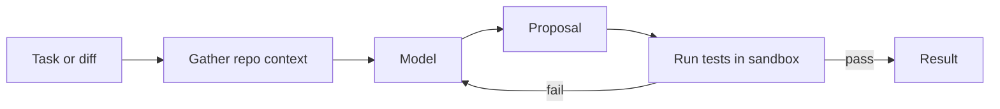

Generating or reviewing code, with compilers and tests as the oracle.

## Diagram



## When to use

Software engineering tasks where correctness can be checked mechanically.

## When *not* to use

Codebases without tests — you lose the one advantage this pattern has.

## Strengths

- Verifiable: tests and compilers are a real oracle, which almost no other pattern has
- Failures are cheap to detect
- Feedback loops can be automated end to end

## Trade-offs

- Repository context selection is the hard problem
- Generated code needs the same security review as written code
- Sandbox execution is required, and is real infrastructure

## Required plugin classes

- repository context
- test runner (sandboxed)
- linters

## Metrics that matter

| Metric | Why it matters for this pattern |
|---|---|
| `test_pass_rate` | |
| `build_rate` | |
| `review_acceptance` | |
| `finding_precision` | |

## Common failure modes

| Failure | Mitigation |
|---|---|
| Confident findings that do not reproduce | Require reproduction before emitting a defect claim. |
| Context window filled with irrelevant files | Rank context by dependency distance, not by name similarity. |

## Scaffold one

```shell
harnessctl new my-harness --pattern code-assistant
```

Generates the standard repository layout, a working prompt, a starter evaluation
suite for this pattern's metrics, and a pipeline that is green on the first run.

## Harnesses implementing this pattern
