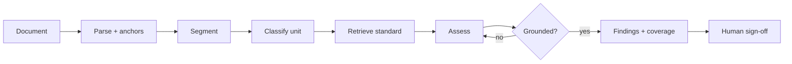

Long documents assessed against a rubric or playbook, clause by clause.

## Diagram



## When to use

A long document must be checked against a known standard, and the reviewer needs to verify each finding.

## When *not* to use

When the document is short enough to review whole, or when there is no written standard to check against — build the standard first.

## Strengths

- Unit-level precision with verifiable citations
- Coverage reporting: what was checked, and what was not
- Findings map onto how experts already work

## Trade-offs

- Segmentation quality gates everything downstream
- Long documents are slow and costly
- Requires a written standard, which is often the real project

## Required plugin classes

- parser with anchors
- playbook or rubric index
- segmentation harness

## Metrics that matter

| Metric | Why it matters for this pattern |
|---|---|
| `coverage` | |
| `grounding_rate` | |
| `expert_agreement` | |
| `severity_agreement` | |

## Common failure modes

| Failure | Mitigation |
|---|---|
| Findings the reviewer cannot verify | Carry anchors end to end; cite page and paragraph. |
| Silent gaps where the standard has no position | Emit UNMATCHED rather than forcing a nearest match — the gaps are valuable output. |
| Split obligations assessed in isolation | Segment on document structure, not token count. |

## Scaffold one

```shell
harnessctl new my-harness --pattern document-review
```

Generates the standard repository layout, a working prompt, a starter evaluation
suite for this pattern's metrics, and a pipeline that is green on the first run.

## Harnesses implementing this pattern
