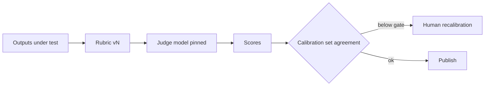

A harness whose product is a judgement about another system.

## Diagram



## When to use

Judging outputs at a scale humans cannot reach, with human review to calibrate.

## When *not* to use

As a replacement for human review rather than an amplifier of it.

## Strengths

- Reusable across the estate
- Makes every other harness's evidence cheaper to produce
- Judgements are themselves measurable against human labels

## Trade-offs

- Judge drift: the judge model changes and the scores move for no other reason
- Calibration is ongoing work, not a one-off
- Rubric quality is the ceiling; a vague rubric produces confident noise

## Required plugin classes

- judge model access
- dataset store
- metric library

## Metrics that matter

| Metric | Why it matters for this pattern |
|---|---|
| `human_agreement` | |
| `calibration_stability` | |
| `inter_judge_agreement` | |

## Common failure modes

| Failure | Mitigation |
|---|---|
| Scores move after a model upgrade | Pin the judge build, record it in every report, re-baseline deliberately. |
| Judge agrees with itself, not with experts | Maintain a calibration set with a hard agreement gate. |

## Scaffold one

```shell
harnessctl new my-harness --pattern evaluation-harness
```

Generates the standard repository layout, a working prompt, a starter evaluation
suite for this pattern's metrics, and a pipeline that is green on the first run.

## Harnesses implementing this pattern
