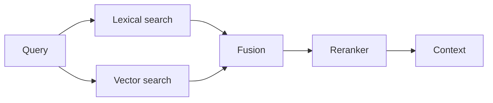

Lexical and vector retrieval, fused and reranked.

## Diagram



## When to use

Exact terms — clause numbers, error codes, product SKUs, people's names — matter as much as meaning.

## When *not* to use

When a plain vector index already meets the recall target. The second index is real operational cost.

## Strengths

- Catches what embeddings miss
- Much better on rare and out-of-vocabulary tokens
- Fusion weights are tunable against a labelled set

## Trade-offs

- Two indexes to build, sync and monitor
- Fusion weights need their own evaluation
- Reranking adds latency and cost per query

## Required plugin classes

- lexical index
- vector index
- reranker

## Metrics that matter

| Metric | Why it matters for this pattern |
|---|---|
| `recall@k` | |
| `mrr` | |
| `grounding_rate` | |

## Common failure modes

| Failure | Mitigation |
|---|---|
| Fusion tuned by intuition | Tune against a labelled query set, and publish the set. |
| Reranker doubles p95 latency | Rerank only the top 20-30; measure before and after. |

## Scaffold one

```shell
harnessctl new my-harness --pattern hybrid-search
```

Generates the standard repository layout, a working prompt, a starter evaluation
suite for this pattern's metrics, and a pipeline that is green on the first run.

## Harnesses implementing this pattern
