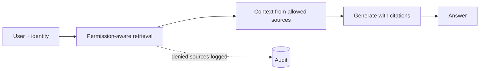

One front door for enterprise-wide question answering.

## Diagram



## When to use

Users do not know which system holds the answer, and permission-aware retrieval across sources is available.

## When *not* to use

Before permission-aware retrieval exists. A knowledge assistant that leaks is worse than no assistant.

## Strengths

- One entry point instead of ten
- High adoption; often the flagship internal use case
- Consolidates retrieval investment

## Trade-offs

- Permission-aware retrieval is the hard part and is non-negotiable
- Ownership is diffuse: everyone's corpus, nobody's problem
- Quality varies wildly by corpus, and users experience the worst case

## Required plugin classes

- permission-aware retrieval
- identity context
- citation formatter

## Metrics that matter

| Metric | Why it matters for this pattern |
|---|---|
| `grounding_rate` | |
| `permission_leak_rate (must be 0)` | |
| `coverage` | |
| `deflection_rate` | |

## Common failure modes

| Failure | Mitigation |
|---|---|
| A single unindexed corpus destroys trust | Publish coverage: say what is not searched. |
| Permission bypass through cached context | Scope caches by identity, and test for it explicitly. |

## Scaffold one

```shell
harnessctl new my-harness --pattern knowledge-assistant
```

Generates the standard repository layout, a working prompt, a starter evaluation
suite for this pattern's metrics, and a pipeline that is green on the first run.

## Harnesses implementing this pattern
