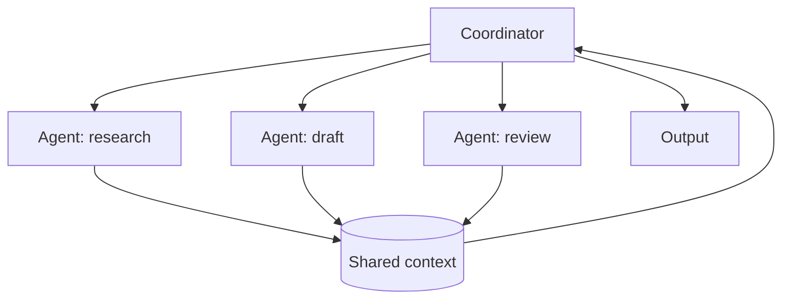

Several cooperating roles with an explicit coordination protocol.

## Diagram



## When to use

Roles genuinely need different tools, contexts or trust boundaries — for example a drafter that cannot see production data and a reviewer that can.

## When *not* to use

Almost always. **Try a deterministic workflow with one model first.**

## Strengths

- Real specialisation of tools and context
- Parallelism across independent roles
- Trust boundaries can be enforced per role

## Trade-offs

- 3-10x the cost of a single-model equivalent
- Hard to debug: failures emerge from interactions, not steps
- Non-deterministic; evaluation needs many more runs to be meaningful
- Coordination overhead frequently exceeds the specialisation benefit

## Before you choose this

> Before choosing multi-agent, try `workflow-automation` with a single model. In our estate, 6 of the 9 multi-agent harnesses reviewed in 2026-H1 were reimplemented as deterministic workflows with equal or better quality at 25-40% of the cost. Multi-agent earns its cost when roles need genuinely different tools, contexts or trust boundaries — not when the task merely has several steps.

## Required plugin classes

- orchestration
- per-role tools
- shared memory or message log

## Metrics that matter

| Metric | Why it matters for this pattern |
|---|---|
| `per_role_success` | |
| `coordination_overhead` | |
| `cost_per_case` | |
| `pass_rate` | |

## Common failure modes

| Failure | Mitigation |
|---|---|
| Agents talking in circles | Hard iteration ceiling, then fail loudly. |
| Cost 10x the estimate | Budget per run, enforced by the runtime, not by hope. |

## Scaffold one

```shell
harnessctl new my-harness --pattern multi-agent
```

Generates the standard repository layout, a working prompt, a starter evaluation
suite for this pattern's metrics, and a pipeline that is green on the first run.

## Harnesses implementing this pattern
