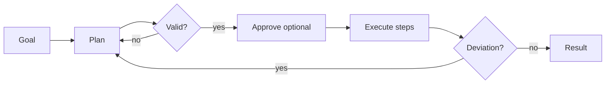

Produce a plan, validate it, then execute it separately.

## Diagram



## When to use

Multi-step tasks where the plan is worth inspecting — or approving — before anything happens.

## When *not* to use

Short tasks where planning costs more than doing.

## Strengths

- The plan is reviewable, cacheable and reusable
- Execution failures localise to a step
- Human approval fits naturally between the phases

## Trade-offs

- Two model passes: more cost and latency
- Plans drift from execution reality
- Replanning logic is easy to get wrong

## Required plugin classes

- varies
- plan validator

## Metrics that matter

| Metric | Why it matters for this pattern |
|---|---|
| `plan_validity` | |
| `replan_rate` | |
| `pass_rate` | |

## Common failure modes

| Failure | Mitigation |
|---|---|
| Plans that ignore execution constraints | Validate against the real tool set, not a description of it. |

## Scaffold one

```shell
harnessctl new my-harness --pattern planner
```

Generates the standard repository layout, a working prompt, a starter evaluation
suite for this pattern's metrics, and a pipeline that is green on the first run.

## Harnesses implementing this pattern
