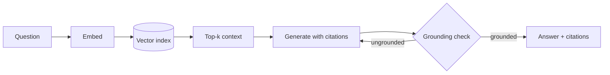

Ground answers in a document corpus, with citations.

## Diagram



## When to use

Answers must come from a specific corpus, the corpus changes independently of the model, and users need to check the source.

## When *not* to use

When the corpus is small enough to fit in context and stable — long context is simpler. When questions need computation over structured data — use `sql-agent`.

## Strengths

- Grounded and citable
- Corpus updates without touching the harness
- Retrieval quality is measurable independently of generation

## Trade-offs

- Retrieval quality is the ceiling on answer quality
- Chunking is fiddly and corpus-specific
- Index freshness becomes an operational concern with an owner and an SLA
- Permission-aware retrieval is significantly harder than it looks

## Required plugin classes

- retrieval index (vector or hybrid)
- document parser
- citation formatter (recommended)

## Metrics that matter

| Metric | Why it matters for this pattern |
|---|---|
| `grounding_rate` | |
| `citation_precision` | |
| `recall@k` | |
| `pass_rate` | |

## Common failure modes

| Failure | Mitigation |
|---|---|
| Right documents retrieved, wrong answer generated | Measure retrieval and generation separately before tuning either. |
| Citations that do not support the claim | Add an exact-match grounding check — compose `citation-grounding`. |
| Quality collapses on rare terms | Vectors miss exact tokens. Move to `hybrid-search`. |

## Scaffold one

```shell
harnessctl new my-harness --pattern rag
```

Generates the standard repository layout, a working prompt, a starter evaluation
suite for this pattern's metrics, and a pipeline that is green on the first run.

## Harnesses implementing this pattern
