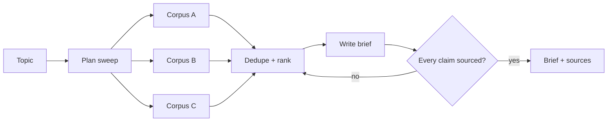

Open-ended investigation across many sources, producing a sourced brief.

## Diagram



## When to use

The question is genuinely open and breadth matters more than a single precise answer.

## When *not* to use

When the answer lives in one known corpus — that is `rag`, at a tenth of the cost.

## Strengths

- Surfaces unknowns and contradictions
- A rejected-sources list makes the output reviewable
- High perceived value for expensive human time

## Trade-offs

- Unbounded cost without hard ceilings
- Quality is genuinely hard to evaluate
- Breadth encourages plausible-sounding synthesis over evidence

## Required plugin classes

- search across corpora
- retrieval
- citation formatter

## Metrics that matter

| Metric | Why it matters for this pattern |
|---|---|
| `source_diversity` | |
| `claim_support_rate` | |
| `cost_per_report` | |
| `human_agreement` | |

## Common failure modes

| Failure | Mitigation |
|---|---|
| Cost varies by an order of magnitude | Set a depth parameter that maps to a hard ceiling. |
| Same document cited twice under different ids | Deduplicate across corpora before writing. |

## Scaffold one

```shell
harnessctl new my-harness --pattern research-assistant
```

Generates the standard repository layout, a working prompt, a starter evaluation
suite for this pattern's metrics, and a pipeline that is green on the first run.

## Harnesses implementing this pattern
