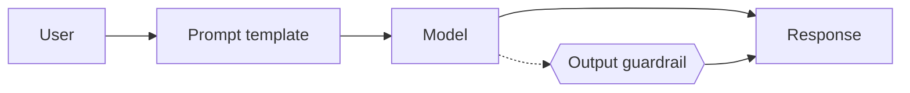

One prompt, one response. No retrieval, no tools.

## Diagram



## When to use

Bounded question answering where the model's own knowledge is sufficient and the cost of being wrong is low.

## When *not* to use

Anything factual about the business. Without grounding you are betting on training data you do not control.

## Strengths

- Cheapest and fastest option
- Trivial to test and reason about
- No infrastructure beyond the model gateway

## Trade-offs

- No grounding: hallucination risk on any factual question
- No freshness: nothing updates without a prompt change
- Ceiling on usefulness is reached quickly

## Required plugin classes

- none

## Metrics that matter

| Metric | Why it matters for this pattern |
|---|---|
| `pass_rate` | |
| `refusal_appropriateness` | |

## Common failure modes

| Failure | Mitigation |
|---|---|
| Confident invention of internal facts | Move to `rag`. This is not a prompting problem. |
| Prompt grows into a knowledge base | The prompt is now an unversioned document store — move to retrieval. |

## Scaffold one

```shell
harnessctl new my-harness --pattern simple-chat
```

Generates the standard repository layout, a working prompt, a starter evaluation
suite for this pattern's metrics, and a pipeline that is green on the first run.

## Harnesses implementing this pattern
