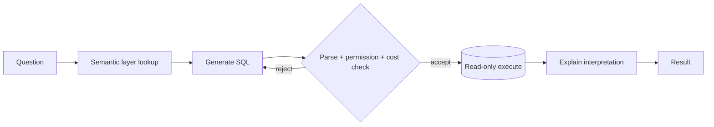

Natural language over structured data, executed read-only.

## Diagram



## When to use

Analysts and business users need answers from a modelled warehouse, and results can be checked.

## When *not* to use

Unmodelled schemas. Without a semantic layer the model re-infers column meaning per question and gets it subtly wrong.

## Strengths

- High perceived value
- Results are checkable by running the query
- The generated SQL is an artefact people can review and reuse

## Trade-offs

- Schema comprehension is the whole problem
- **Write access must be prohibited**, not merely discouraged
- Wrong-but-plausible answers are expensive and hard to notice
- Row-level security must be the caller's, not the harness's

## Required plugin classes

- read-only database connector
- schema or semantic layer catalogue

## Metrics that matter

| Metric | Why it matters for this pattern |
|---|---|
| `execution_accuracy` | |
| `result_exact_match` | |
| `interpretation_agreement` | |

## Common failure modes

| Failure | Mitigation |
|---|---|
| Right query, wrong question | Publish the interpretation alongside the result; most errors are here. |
| Fiscal versus calendar periods | Encode period definitions in the semantic layer, never in the prompt. |
| Runaway query cost | Cost-estimate before execution and cap it. |

## Scaffold one

```shell
harnessctl new my-harness --pattern sql-agent
```

Generates the standard repository layout, a working prompt, a starter evaluation
suite for this pattern's metrics, and a pipeline that is green on the first run.

## Harnesses implementing this pattern
