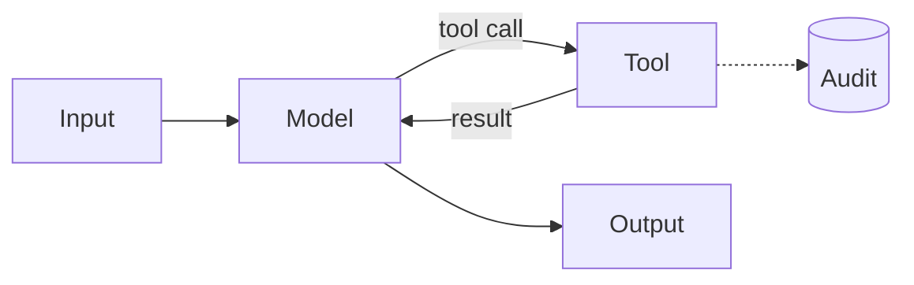

The model reads or changes external state through a bounded tool set.

## Diagram



## When to use

Real work requires touching another system, and the set of actions is known in advance.

## When *not* to use

When the action set is open-ended (that is `agentic`), or when the sequence is fixed (that is `workflow-automation` — cheaper and more predictable).

## Strengths

- Genuine capability rather than text about capability
- Tool behaviour is deterministic and independently testable
- Permissions are enforced by the tool, not by the prompt

## Trade-offs

- Tool schema quality dominates outcome quality
- Error handling is most of the implementation
- Every write tool is a blast radius; read-only by default is the sane posture

## Required plugin classes

- one plugin per tool
- audit sink

## Metrics that matter

| Metric | Why it matters for this pattern |
|---|---|
| `tool_selection_accuracy` | |
| `error_recovery_rate` | |
| `pass_rate` | |

## Common failure modes

| Failure | Mitigation |
|---|---|
| Model calls the right tool with the wrong arguments | The schema is under-specified. Add examples and constrain enums. |
| Silent failure on tool error | Feed the error back to the model explicitly and evaluate recovery as a metric. |
| Write tools invoked speculatively | Separate read and write phases; require confirmation for writes. |

## Scaffold one

```shell
harnessctl new my-harness --pattern tool-calling
```

Generates the standard repository layout, a working prompt, a starter evaluation
suite for this pattern's metrics, and a pipeline that is green on the first run.

## Harnesses implementing this pattern
