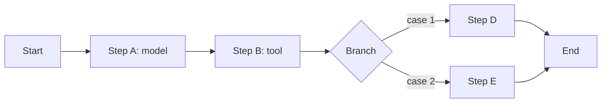

A fixed graph of model and tool steps; control flow lives in code.

## Diagram



## When to use

The process is known, must be auditable, and must behave the same way twice.

## When *not* to use

When the path genuinely varies per input and enumerating branches is intractable.

## Strengths

- Deterministic control flow: reviewable, testable, predictable cost
- Failures localise to a step
- Easiest pattern to gate and audit

## Trade-offs

- Inflexible to cases the author did not foresee
- Longer to build than an agent loop
- Can accrete branches until it is unreadable

## Required plugin classes

- varies by step

## Metrics that matter

| Metric | Why it matters for this pattern |
|---|---|
| `step_success_rate` | |
| `pass_rate` | |
| `cost_per_case` | |

## Common failure modes

| Failure | Mitigation |
|---|---|
| Branch explosion | If the graph exceeds ~15 steps, reconsider the decomposition. |
| Model output used as control flow | That makes it an agent with extra steps — be explicit about which you are building. |

## Scaffold one

```shell
harnessctl new my-harness --pattern workflow-automation
```

Generates the standard repository layout, a working prompt, a starter evaluation
suite for this pattern's metrics, and a pipeline that is green on the first run.

## Harnesses implementing this pattern
